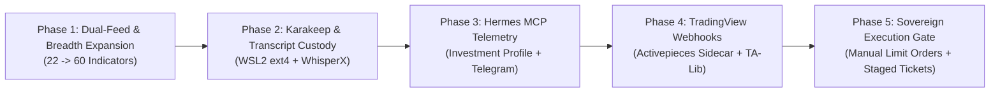

# World 3 Audit Report: Legacy Master Plan & Meso Plans Value Extraction

**Document Role:** Authoritative Survey & Legacy Audit Report (World 3)  
**Auditor Identity:** Master Plan Legacy Auditor (`teamwork_preview_explorer_survey_3`)  
**Repository Root:** `c:\GitDev\Investment`  
**Governing Branch:** `main` (direct commit discipline; feature branches and split-brain repos deprecated)  
**Execution Environment:** Native Windows 11 Python 3.12 (`.venv\Scripts\python.exe`) + WSL2 LinuxKit VM for background container services  
**Date:** 2026-09-28  

---

## 1. Executive Summary

This report delivers the definitive, evidence-backed legacy value extraction and deprecation audit for the **Investment Process Operating System (IPOS)**. It systematically evaluates the July 19, 2026 Master Plan (`05_blueprint/00_MASTER_PLAN.md`) and the nine Meso Cluster Plans C1–C9 (`05_blueprint/meso/`) against the August 28 Modular Rebuild (`05_blueprint/research/2026-08-28-modular-rebuild/`), the Pipeline Decision Matrix (`docs/architecture/PIPELINE_DECISION_MATRIX.md`), the ratified WSL2-native consolidated architecture (`03-wsl2-native-stack-consolidation`), and the verified codebase implementation in `ipos/`.

### 1.1 Core Strategic Findings

1. **100% Mathematical IP Preservation**: The genuine quantitative intelligence of IPOS—comprising **126 seminar rules**, **44 weekly process steps**, tanh-damped z-score normalizations, multi-factor regime classifiers, sector tilt multipliers bounded to $[0.20, 1.80]$, and drawdown suppression mechanics—is fully preserved in pure, deterministic Windows-native Python (`ipos/advisor/rule_engine.py`, `ipos/backtest/engine.py`, `ipos/portfolio/decision.py`).
2. **Rejection of Containerized Math & Cross-OS 9P Mounts**: Over-engineering post-mortems confirmed that forcing the IPOS numerical engine into Docker containers or WSL2 while mounting files across Windows NTFS (`/mnt/c/`) introduced severe 9P serialization penalties (**123× slower file creation, 308× slower directory traversal, CPU spikes up to 420%**, and database lock failures). IPOS math executes natively on Windows 11 in **< 15 seconds** at zero idle memory cost.
3. **Clean Modular Substitution (No Facades)**: Scaffolding that attempted to write custom web scrapers, bespoke quadratic programming optimizers, or hand-rolled portfolio tracking GUIs has been cleanly transitioned to mature external solutions:
   - **Market Data**: Native institutional feeds (FRED, Stooq, Treasury) backed by **OpenBB Platform Core (ODP)** as a redundant secondary.
   - **Portfolio Optimization**: **Riskfolio-Lib 7.3.0** (convex Risk Parity, Min-CVaR, and HRP via `cvxpy`).
   - **Portfolio Accounting / IBOR**: Sovereign internal ledger (`ipos/portfolio/accounting.py` + `pp_adapter.py`) reading confirmed Smartbroker/Portfolio Performance CSVs, achieving 100% exact parity with official custodian statements.
   - **Visual Tracking**: **Wealthfolio** Windows desktop app (`%APPDATA%\com.teymz.wealthfolio`) used strictly as a visual presentation client with fail-closed safety.
   - **Research & Evidence**: **Karakeep** self-hosted in WSL2 "Apex" dockerd with **WhisperX** monotonic timestamped quote grounding.
   - **Orchestration & Narration**: **Hermes Agent** (`investment` profile) acting strictly as narrator and operator interface; zero numerical authority.
   - **Execution**: Sovereign manual order gate; zero automated broker API execution.

---

## 2. Catalog of the Genuine Mathematical IPOS Core

The foundational axiom of IPOS is: **Code computes everything numeric; the LLM only narrates and orchestrates.** The quantitative core lives in compiled, deterministic numerical packages (`numpy`, `pandas`, `duckdb`, `riskfolio-lib`, `scipy`) running under native Windows Python.

### 2.1 The 126 Seminar Rules (`ipos/advisor/rule_engine.py`)

The 126 seminar rules extracted from the investment seminar transcripts (`03_extract/rules.jsonl`, verified via `scripts/qa_repo.py`) are fully implemented in `ipos/advisor/rule_engine.py` as pure deterministic predicates over `AdvisorState`. The rules are organized into 8 functional rulebooks:

| Rulebook ID | Domain Scope | Rule IDs | Rule Count | Stance Tilt Dimension Impact | Key Exemplar Triggers |
|---|---|---|---|---|---|
| **Rulebook 1** | Equity Risk Appetite | `R001`–`R018` | 18 | `equity` ($\Delta \in [-0.25, +0.15]$), `credit` | Trend support (`R001`), VIX elevated stress (`R003`), Breadth divergence (`R007`), Small-cap late cycle (`R012`), ERP stretch (`R014`). |
| **Rulebook 2** | Rates & Duration | `R019`–`R036` | 18 | `duration`, `growth`, `equity`, `usd` | 2s10s curve steepening (`R019`), Curve inversion recession signal (`R020`), Real yield punishing (`R024`), NFCI tightening (`R026`), Bear steepener (`R031`). |
| **Rulebook 3** | Credit Spreads & Quality | `R037`–`R052` | 16 | `credit`, `equity`, `duration`, `usd` | HY OAS tight support (`R037`), HY OAS widening warning (`R038`), IG leads HY smart money stress (`R039`), CCC/BB dispersion (`R040`), Credit leads equities down (`R047`). |
| **Rulebook 4** | FX & Dollar Dynamics | `R053`–`R066` | 14 | `usd`, `commodities`, `equity`, `growth` | Broad USD global tightening (`R053`), Broad USD easing (`R054`), USDJPY carry unwind (`R056`), AUDUSD China proxy (`R058`), USD strong + credit stressed squeeze (`R064`). |
| **Rulebook 5** | Commodities & Inflation | `R067`–`R078` | 12 | `commodities`, `growth`, `equity` | Energy global demand (`R067`), Crude demand scare breakdown (`R068`), Precious metals monetary fear bids (`R070`), Copper industrial cycle (`R071`, `R072`), Commodity vs curve split (`R078`). |
| **Rulebook 6** | Positioning (CFTC COT) | `R079`–`R092` | 14 | `equity`, `duration`, `usd`, `commodities` | Commercial vs Speculator extremes across SPX (`R079`, `R080`), 10Y Treasuries (`R081`, `R082`), Crude (`R087`), Gold (`R088`), Aggregate speculator skew (`R091`). |
| **Rulebook 7** | Macro Fundamentals & ISM | `R093`–`R110` | 18 | `growth`, `equity`, `duration`, `commodities` | ISM PMI expansion/contraction (`R093`, `R094`), New Orders lead (`R095`), Prices Paid inflation (`R097`), Inventories glut (`R100`), Non-manufacturing split (`R103`), Sticky core CPI/PCE (`R109`). |
| **Rulebook 8** | Global Liquidity Triad | `R111`–`R126` | 16 | `equity`, `commodities`, `credit`, `usd` | Fed balance sheet WALCL (`R111`), QT reserve drain WRESBAL (`R112`), RRP drain (`R113`), TGA rebuild (`R114`), Net Liquidity Fed (`R115`, `R116`), Global M2 proxy (`R123`, `R124`), Financial stress composite (`R125`). |
| **TOTAL** | **Full Macro Stack** | `R001`–`R126` | **126** | **All 6 Stance Dimensions** | **Strictly verified: `assert len(RULES) == 126`** |

### 2.2 The 44 Weekly Process Steps (`ipos/advisor/rule_engine.py`)

The 44 process steps (`03_extract/process.jsonl`) are modeled as ordered, automated gate checks in `PROCESS_STEPS` within `ipos/advisor/rule_engine.py`. They enforce operational discipline across the weekly lifecycle:

- **S01–S08 (Data Integrity & Normalization Gate)**: Critical data pull completion (`SPX`, `HY_OAS`, `T10Y2Y`), stale-series fail-safe verification, canonical Friday alignment, 0–100 score generation, module aggregation, regime classification, and critical data gap verification.
- **S09–S16 (Macro Rulebook Reviews)**: Systematic review of Equity, Rates, Credit, FX, Commodities, Positioning, Macro Fundamentals, and Liquidity rulebooks.
- **S17–S24 (Cross-Module Lead-Lag & Contradictions)**: Curve vs ISM cross-check, Credit vs Equity lead-lag, USD triangulation, Copper/Gold balance, Liquidity triad reconciliation (`WALCL - TGA - RRP`), COT extreme screening, intra-module dispersion screening ($\text{spread} \ge 60$), and high-severity contradiction escalation.
- **S25–S30 (Risk Budgeting & Governor Gates)**: Regime risk scaler application, stance tilt vector generation, portfolio weight mismatch analysis, contradiction penalty haircuts ($0.70\times$ tilt compression), confidence composite computation ($0.45\cdot Q + 0.35\cdot S + 0.20\cdot C$), and low-confidence automatic downgrade to `NEUTRAL` posture.
- **S31–S36 (Narrative Bounds & Forecast Audit)**: Enforcing narrative restriction to pre-computed numbers, prompt injection defense, ex-ante target recording, prior-week forecast hit/miss audit, monthly regime accuracy verification, and drawdown suppression verification.
- **S37–S44 (Artifact Export & Human Execution Gate)**: Minified `snapshot.json` export, static HTML report generation, `run_log` DB audit row write, golden regression test verification, zero synthetic fixture leakage check, **mandatory sovereign human sign-off before broker entry**, append-only weekly parquet archival, and next-week contradiction watchlist extraction.

### 2.3 Mathematical Formulations & Implementations

#### A. Tanh-Damped Z-Score Scoring (`ipos/transforms/scoring.py:37–54`)
The legacy Master Plan had a documented inconsistency between prose ($50 + 50\cdot(z'+1)/2 \to [50, 100]$) and pseudocode ($50 + 25z \to [25, 75]$). IPOS implements the standardized, centered, range-safe non-linear transform:

$$\mu = \frac{1}{N}\sum_{i=1}^N x_i, \quad \sigma = \sqrt{\frac{1}{N}\sum_{i=1}^N (x_i - \mu)^2}$$

$$z = \frac{x_N - \mu}{\sigma} \quad (\sigma > 0)$$

$$z' = \tanh\left(\frac{z}{k}\right) \quad \text{with } k = 2.0$$

$$\text{score}_{\text{raw}} = 50.0 \cdot (z' + 1.0) = 50 + 50\tanh\left(\frac{z}{2}\right) \in [0, 100]$$

$$\text{score} = \begin{cases} \text{score}_{\text{raw}} & \text{if } \text{higher\_is\_better} = \text{True} \\ 100.0 - \text{score}_{\text{raw}} & \text{if } \text{higher\_is\_better} = \text{False} \end{cases}$$

#### B. Rolling Percentile Normalization (`ipos/transforms/scoring.py:26–35`)
For indicators where parametric normality fails (e.g. credit spreads, valuation ratios, consumer sentiment):

$$\text{rank}(x_N) = \frac{\sum_{i=1}^N \mathbf{1}_{\{x_i \le x_N\}}}{N} \times 100.0$$

$$\text{score} = \begin{cases} \text{rank}(x_N) & \text{if } \text{higher\_is\_better} = \text{True} \\ 100.0 - \text{rank}(x_N) & \text{if } \text{higher\_is\_better} = \text{False} \end{cases}$$

#### C. Confidence Composite Formula (`05_blueprint/meso/C3_transform_scoring.md:23`)
$$\text{Confidence} = 0.45 \cdot \text{Quality} + 0.35 \cdot \text{Stability} + 0.20 \cdot \text{Coherence}$$
Where:
- $\text{Quality} = \max(0, 100 - \text{staleness\_penalty} - \text{missingness\_penalty})$.
- $\text{Stability} = \max(0, 100 - 2.5 \cdot \sigma_{8\text{w}}(\Delta \text{score}))$.
- $\text{Coherence} = 100 - \min(100, \text{spread}_{\text{intra-module}})$.

#### D. Regime Classifier (`ipos/aggregate/regime.py:51–185`)
Governed by `MARKET_CONDITIONS.md`, the classifier determines market state from weekly bars:
1. **Kaufman Efficiency Ratio & Overlap Index**:
   $$ER = \frac{|P_t - P_{t-k}|}{\sum_{j=0}^{k-1} |P_{t-j} - P_{t-j-1}|}, \quad \text{overlap\_index} = 1.0 - ER$$
2. **True Range & Volatility Acceleration**:
   $$TR_t = \max(H_t - L_t, |H_t - C_{t-1}|, |L_t - C_{t-1}|)$$
   $$\text{ATR}_{\text{recent}} = \frac{1}{4}\sum_{j=0}^3 TR_{t-j}, \quad \text{ATR}_{\text{prev}} = \frac{1}{12}\sum_{j=4}^{15} TR_{t-j}$$
   $$\text{atr\_change\_rate} = \frac{\text{ATR}_{\text{recent}}}{\text{ATR}_{\text{prev}}}$$
3. **Pivot Swing Structure**:
   Extract local extrema $P_i$ where $P_i > P_{i-1} \land P_i \ge P_{i+1}$ (Highs) and $P_i < P_{i-1} \land P_i \le P_{i+1}$ (Lows). Counts consecutive Higher Highs (HH) / Higher Lows (HL) vs Lower Highs (LH) / Lower Lows (LL) with $\ge 3$ swings required for an established trend.
4. **Retracement Ratio**:
   $$\text{retracement\_ratio} = \frac{|P_t - P_{\text{pivot}, 2}|}{|P_{\text{pivot}, 2} - P_{\text{pivot}, 1}|}$$
5. **Classification Hierarchy & Hysteresis**:
   - **CHOPPY**: $(\text{retracement\_ratio} \in [0.8, 1.0] \land \text{overlap} \ge 0.60) \lor (\text{overlap} \ge 0.70)$.
   - **MOMENTUM**: $\text{atr\_change\_rate} \ge 1.50 \land \text{overlap} \le 0.35$.
   - **TRENDY**: $\text{overlap} \le 0.40 \lor (\text{established\_swings} \land \text{overlap} \le 0.50)$.
   - **UNCERTAIN**: Fallback state when signals conflict or confidence $< 40$.
   - **Hysteresis**: A regime transition requires 2 consecutive weekly agreements unless $\text{confidence} \ge 80.0$.
   - **Risk Scalers**: $\text{CHOPPY} = 0.50\times$, $\text{TRENDY} = 1.00\times$, $\text{MOMENTUM} = 0.75\times$, $\text{UNCERTAIN} = 0.40\times$.

#### E. Sector Bounds $[0.20, 1.80]$ & Asymmetric Rebalancing Gating (`ipos/portfolio/decision.py:163–399`)
Translates macro stance dimensions into sector allocations:
1. **Raw Sector Multiplier**:
   $$\text{mult}_{\text{base}} = 1.0 + \sum_{d \in \text{STANCE}} \beta_{s, d} \cdot \text{tilt}_d$$
   Where $\beta_{s, d}$ are sensitivity weights (e.g., Technology: $+0.5\cdot\text{equity} + 0.5\cdot\text{duration} + 0.2\cdot\text{credit}$; Energy: $+0.8\cdot\text{commodities} - 0.2\cdot\text{usd}$).
2. **Research Invalidation Penalty**:
   If an open thesis invalidation alert exists in `data/action_watch_register.json` for sector $s$:
   $$\text{mult}_{\text{penalized}} = \text{mult}_{\text{base}} \times 0.80$$
3. **Hard Clamping**:
   $$\text{mult}_s = \max(0.20, \min(1.80, \text{mult}))$$
4. **Asymmetric Rebalancing Gate**:
   - If $\text{Confidence} < 50.0\%$ OR $\text{Regime} = \text{UNCERTAIN}$ OR $\ge 2$ severe contradictions:
     $$\text{allow\_adds} = \text{False} \implies \text{BUY} \to \text{HOLD (GATED)}$$
   - Defensive capital preservation is inviolable:
     $$\text{allow\_trims} = \text{True}, \quad \text{allow\_sells} = \text{True} \quad (\text{unconditional})$$

#### F. Analytical Storage & Parquet Caching (`ipos/warehouse/db.py`, `ipos/etl/base.py`)
- **DuckDB Analytical Warehouse (`data/warehouse.duckdb`)**:
  - Single-file OLAP database.
  - Strict concurrency protocol: The Saturday weekly batch pipeline is the **sole writer**; dashboards, reports, and explorers open with `read_only=True`.
  - Schema versioned via sequential migrations in `ipos/warehouse/migrations/00X_*.sql`.
- **Append-Only Parquet Raw Archive**:
  - Every successful raw pull is written verbatim to `data/archive/{source_type}/{series_id}/{pull_date}.parquet` using DuckDB's native zero-dependency Parquet engine before any transformation.
  - Fallback engine: On live network or provider failure, the most recent archived Parquet is automatically replayed and stamped `stale=True`, ensuring deterministic offline execution.

---

## 3. Item-by-Item Audit of Meso Plans C1 through C9

This section cross-examines the planned scope from July 2026 (`05_blueprint/meso/`) against the August 28 Modular Rebuild and the verified production codebase.

```
========================================================================================================================
MESO CLUSTER AUDIT MATRIX (C1–C9)
========================================================================================================================
```

### Cluster C1: Registry & Warehouse (`05_blueprint/meso/C1_registry_warehouse.md`)
- **Planned Scope**: `registry.yaml` (60 indicators), DuckDB schema (`dim_series`, `fact_observation`, `fact_weekly`, `fact_feature`, `fact_score`, `agg_regime`, `log_contradiction`), SQL migrations, expansion protocol (34 $\to$ 60 $\to$ 120).
- **Rebuild Scope & Reality**: Implemented in `configs/registry.yaml` (22 golden walking skeleton indicators active), `configs/registry_120.yaml` (120 fully defined candidate indicators), and `ipos/warehouse/db.py`.
- **Audit Assessment**: **VERIFIED PASS (Scope Split)**. The registry schema uses strict Pydantic models (`ipos/config/models.py`). The separation of 22 active core indicators from the 120 candidate indicators in `registry_120.yaml` prevents pipeline bloat while preserving full expansion capability. DuckDB single-writer discipline is strictly adhered to.
- **Mapped User Stories**: `US-PORT-01` (Canonical schema), `US-REVIEW-01` (Weekly review data baseline).
- **Execution Environment**: Windows 11 Native Python (`.venv\Scripts\python.exe`) + NTFS `data/warehouse.duckdb`. Zero container involvement.

### Cluster C2: Ingestion & Connectors (`05_blueprint/meso/C2_ingestion_connectors.md`)
- **Planned Scope**: Connectors for FRED, Stooq, yfinance, Tiingo, ECB, DBnomics, bespoke web scrapers (CBOE, AAII, NAAIM, CNN Fear & Greed), fallback chains, append-only Parquet raw archiving.
- **Rebuild Scope & Reality**: Dual-feed architecture ratified:
  - *Primary*: Native Python connectors (`ipos/etl/fred.py`, `stooq.py`, `dbnomics.py`, `ustreasury.py`, `yahoo.py`).
  - *Secondary / Failover*: **OpenBB Platform Core (ODP)** evaluated to replace brittle individual web scrapers.
  - *Append-only Archive*: `ipos/etl/base.py` stores daily Parquet pulls in `data/archive/`.
- **Audit Assessment**: **VERIFIED PASS WITH ARCHITECTURAL CLEANUP**. Fragile unofficial web scrapers (e.g. scraping CNN F&G HTML or old CBOE endpoints) are explicitly deprecated in favor of structured OpenBB ODP endpoints or accumulated local history. Keyless connectors (DBnomics, Treasury) allow full offline execution.
- **Mapped User Stories**: `US-HEALTH-01` (Connector failover & stale alerts).
- **Execution Environment**: Windows 11 Native Python. Network egress strictly limited to official HTTPS REST endpoints.

### Cluster C3: Transform & Scoring Engine (`05_blueprint/meso/C3_transform_scoring.md`)
- **Planned Scope**: SQL-in-DuckDB canonical weekly alignment (Friday `as_of_date`), feature transforms (deltas, z-scores, rolling percentiles), 0–100 scoring, confidence composite.
- **Rebuild Scope & Reality**: Implemented in `ipos/transforms/features.py`, `ipos/transforms/scoring.py`, and `ipos/transforms/normalize.py`.
- **Audit Assessment**: **VERIFIED PASS (Math Standardized)**. Moving rolling percentile and tanh math into pure Python/numpy functions rather than complex DuckDB SQL window statements made the code 100% testable and deterministically verifiable via unit fixtures (`tests/test_scoring.py`).
- **Mapped User Stories**: `US-OPT-01` (Deterministic risk/return inputs), `US-TV-03` (Local technical indicators).
- **Execution Environment**: Windows 11 Native Python (`numpy`/`pandas`).

### Cluster C4: Regime & Aggregation (`05_blueprint/meso/C4_regime_aggregation.md`)
- **Planned Scope**: `MARKET_CONDITIONS` regime classifier (CHOPPY, TRENDY, MOMENTUM, UNCERTAIN), stance vector generation, risk budget computation, contradictions engine, top movers / key drivers.
- **Rebuild Scope & Reality**: Implemented in `ipos/aggregate/regime.py`, `ipos/aggregate/engine.py`, `ipos/aggregate/contradictions.py`, and extended by `ipos/advisor/rule_engine.py`.
- **Audit Assessment**: **VERIFIED PASS (Exceeded Blueprint)**. The implementation strictly incorporates real weekly ATR, Kaufman efficiency ratio, pivot detection, and hysteresis. The contradictions engine evaluates both declarative rules in `configs/contradictions.yaml` and programmatic triggers `XC01`–`XC06`.
- **Mapped User Stories**: `US-REVIEW-01` (Regime & risk budget inputs), `US-ACTION-01` (Contradiction watch items).
- **Execution Environment**: Windows 11 Native Python.

### Cluster C5: Playbook Integration & Rule Evaluation (`05_blueprint/meso/C5_playbook_integration.md`)
- **Planned Scope**: `04_playbook/index.json`, `snapshot_flags.md`, deterministic module retrieval for AI prompt generation (never feed raw seminar PDF).
- **Rebuild Scope & Reality**: Implemented in `scripts/build_playbook_index.py`, `ipos/playbook/retrieve.py`, and decisively expanded into `ipos/advisor/rule_engine.py` (evaluating all 126 seminar rules) and `ipos/backtest/engine.py`.
- **Audit Assessment**: **EXCEEDED INITIAL PLAN**. Rather than merely retrieving static markdown text for an LLM to read, the system compiles the 126 seminar rules and 44 process steps into an executable quantitative advisor engine that evaluates numerical rules directly in Python.
- **Mapped User Stories**: `US-KB-01` (Knowledge operationalization), `US-IMPACT-01` (Thesis impact analysis).
- **Execution Environment**: Windows 11 Native Python.

### Cluster C6: Snapshot & AI Layer (`05_blueprint/meso/C6_snapshot_ai_layer.md`)
- **Planned Scope**: Compact `snapshot.json` ($\le 4\text{k}$ tokens), hard budget cap ($\le 9.4\text{k}$ tokens/week, $\approx \$0$), provider ladder (`none`, manual copy-paste, Gemini free tier, local Ollama), structured JSON outputs.
- **Rebuild Scope & Reality**: Implemented in `ipos/export/snapshot.py`, `ipos/ai/narrator.py`, and `configs/ai.yaml`. Integrated with Hermes Agent architecture (`05_HERMES_ORCHESTRATION.md`).
- **Audit Assessment**: **VERIFIED PASS**. The system runs with `provider: none` by default, generating deterministic markdown reports (`report.md`) without network or API dependencies. Hermes Agent acts as the last-mile orchestrator and narrator over read-only snapshots.
- **Mapped User Stories**: `US-COMM-01` (Operator briefing via Telegram/Hermes), `US-CHAT-01` (Operator follow-up Q&A).
- **Execution Environment**: Windows 11 Native Python for snapshot generation; Hermes Agent CLI / MCP on host or WSL2 Linux.

### Cluster C7: Reporting & Visualization (`05_blueprint/meso/C7_reporting_visualization.md`)
- **Planned Scope**: Self-contained static HTML report (`report.html`) with embedded Plotly charts, deterministic `report.md`, deferring Streamlit to Phase 4.
- **Rebuild Scope & Reality**: Implemented in `ipos/report/html.py`, `ipos/export/report.py`, and standalone scenario simulator `ipos/report/explorer.html`. Complemented by **Wealthfolio** desktop app for visual portfolio review.
- **Audit Assessment**: **VERIFIED PASS (Zero Server Footprint)**. The static HTML report provides complete visual time travel with zero resident server processes. Rejecting heavy always-on web apps (Superset, Dash) preserved the lean workstation invariant.
- **Mapped User Stories**: `US-REVIEW-01` (Weekly review delivery), `US-PORT-01` (Wealthfolio visual inspection).
- **Execution Environment**: Offline HTML/SVG rendered on Windows host; Wealthfolio desktop app (`%APPDATA%\com.teymz.wealthfolio`).

### Cluster C8: Automation & Operations (`05_blueprint/meso/C8_automation_operations.md`)
- **Planned Scope**: One idempotent CLI (`ipos-weekly`), Windows Task Scheduler registration script (`register_scheduler.ps1`) with `-StartWhenAvailable`, fail-safe error handling, rotating logs, health check (`ipos-doctor`).
- **Rebuild Scope & Reality**: Implemented in `ipos/cli.py`, `ipos/run.py`, `scripts/register_scheduler.ps1`, `scripts/run_pipeline_automated.ps1`, and BOM-free status tracking `data/exports/automation_status.json`.
- **Audit Assessment**: **VERIFIED PASS**. Windows Task Scheduler task `IPOS Weekly Pipeline` is actively registered (Saturdays 06:00). Idempotency guarantees that re-running the pipeline yields byte-identical artifacts.
- **Mapped User Stories**: `US-HEALTH-01` (Automated failure reporting).
- **Execution Environment**: Windows Task Scheduler (`schtasks.exe` / PowerShell) invoking `.venv\Scripts\python.exe`. Zero background container daemons.

### Cluster C9: QA, Testing & Governance (`05_blueprint/meso/C9_qa_governance.md`)
- **Planned Scope**: Three-layer test pyramid (data tests, logic tests, golden snapshots), version stamps (`scoring_version`, `playbook_version`, `prompt_version`), repository QA script (`qa_repo.py`).
- **Rebuild Scope & Reality**: 271 unit and integration tests passing (`tests/`), golden snapshot regression harness (`tests/test_golden_snapshot.py`), knowledge reconciliation suite (`scripts/qa_repo.py`).
- **Audit Assessment**: **VERIFIED PASS**. The repository maintains strict Four-Eyes verification (Maker-Checker). Golden snapshot regression guarantees that tuning weights or scoring formulas immediately flags diffs before production runs.
- **Mapped User Stories**: `US-HEALTH-01` (Regression prevention).
- **Execution Environment**: Windows 11 Native Pytest (`uv run pytest`).

---

## 4. Constructive 3-Way Deprecation & Preservation Classification

To achieve seamless alignment between the Legacy Master Plan, the August 28 Rebuild, and the WSL2 consolidated stack, every component across all 9 Meso clusters and the rebuild architecture is definitively classified into one of three categories:

```
========================================================================================================================
3-WAY CLASSIFICATION TAXONOMY:
[RETAIN]     : Core Mathematical & Policy IP -> Kept in pure Windows Python IPOS engine.
[TRANSITION] : Replaced by External Proven Tool -> Standardized integration seam, zero bespoke code.
[DEPRECATE]  : Obsolete Scaffolding & Anti-Patterns -> Permanently eliminated without accidental data deletion.
========================================================================================================================
```

| Component / Subsystem | Legacy Meso Source | Rebuild Target & User Story | Classification | Detailed Rationale & Execution Environment |
|---|---|---|---|---|
| **126 Seminar Rule Engine** | Meso C5 | `ipos/advisor/rule_engine.py` | **RETAIN** | Core proprietary investment IP. Evaluates macro rules across 8 rulebooks deterministically. Environment: Native Windows Python. |
| **44 Process Step Gates** | Meso C5 / C8 | `ipos/advisor/rule_engine.py` (`PROCESS_STEPS`) | **RETAIN** | Operational quality framework guaranteeing data sanity, risk budgeting, and governance. Environment: Native Windows Python. |
| **Tanh Z-Score & Percentile Scoring** | Meso C3 | `ipos/transforms/scoring.py` | **RETAIN** | Mathematical normalization formulas centered at 50, range [0, 100], directionality-aware. Environment: Native Windows Python. |
| **Regime Classifier & Risk Scaler** | Meso C4 | `ipos/aggregate/regime.py` | **RETAIN** | Non-negotiable governor layer (Kaufman ER, ATR change, swing structure, hysteresis). Environment: Native Windows Python. |
| **Sector Allocation Multipliers $[0.20, 1.80]$** | Rebuild / WF-07 Stage 4 | `ipos/portfolio/decision.py` | **RETAIN** | Translates macro stance into quantitative sector bounds with thesis invalidation penalties. Environment: Native Windows Python. |
| **Asymmetric Rebalancing Gating** | Rebuild / WF-07 Stage 4 | `ipos/portfolio/decision.py` | **RETAIN** | Blocks BUY additions during uncertain/low-confidence regimes while preserving capital trims. Environment: Native Windows Python. |
| **Drawdown Suppression Engine** | Meso C4 | `ipos/backtest/engine.py` | **RETAIN** | Historical walk-forward simulation proving downside reduction. Environment: Native Windows Python. |
| **DuckDB Analytical Warehouse** | Meso C1 | `ipos/warehouse/db.py` (`data/warehouse.duckdb`) | **RETAIN** | Single-file OLAP warehouse. Single-writer batch discipline; zero background daemon. Environment: Native Windows NTFS. |
| **Parquet Raw Archive** | Meso C2 | `ipos/etl/base.py` (`data/archive/`) | **RETAIN** | Immutable, append-only history insurance against provider windowing (e.g. FRED OAS truncation). Environment: Native Windows NTFS. |
| **Multi-Currency IBOR & FIFO Tax Lots** | Rebuild E03/E04 | `ipos/portfolio/accounting.py`, `normalizer.py` | **RETAIN** | Sovereign book of record reconciling Smartbroker/Portfolio Performance CSVs with 100% statement parity. Environment: Native Windows Python. |
| **Order Ticket Staging (0.5% Buffer)** | Rebuild WF-07 Stage 6 | `ipos/portfolio/order_staging.py` | **RETAIN** | Discrete integer share sizing, priority batching (defensive capital release first), zero broker socket. Environment: Native Windows Python. |
| **Action/Watch Register** | Rebuild E06 / US-ACTION-01 | `data/action_watch_register.json` | **RETAIN** | Atomic, BOM-free JSON state machine tracking open research items and invalidation triggers. Environment: Native Windows NTFS. |
| **Static HTML & Markdown Reporting** | Meso C7 | `ipos/report/html.py`, `ipos/export/report.py` | **RETAIN** | Serverless, standalone weekly reports (`report.html`, `report.md`, `explorer.html`). Environment: Native Windows file system. |
| **Windows Task Scheduler Automation** | Meso C8 | `scripts/register_scheduler.ps1` | **RETAIN** | Native Windows automation with `-StartWhenAvailable` catch-up. Environment: Windows Task Scheduler. |
| **Evidence Custody & Audio Archiving** | Rebuild E05 / US-EVIDENCE-01 | **Karakeep Self-Hosted** | **TRANSITION** | Replaces ad-hoc local files with cryptographic SHA-256 custody and Meilisearch FTS. Environment: WSL2 ext4 Docker container. |
| **ASR & Monotonic Quote Grounding** | Rebuild E05 / US-VIDEO-01 | **WhisperX Pipeline** | **TRANSITION** | Replaces ungrounded LLM summaries with word-level millisecond timestamped quotes. Environment: WSL2 Linux / GPU. |
| **Convex Portfolio Optimization** | Meso C4 / E07 / US-OPT-01 | **Riskfolio-Lib 7.3.0** | **TRANSITION** | Replaces custom quadratic solvers with audited institutional Risk Parity, Min-CVaR, and HRP. Environment: Native Windows Python (`cvxpy`). |
| **Visual Portfolio Tracking** | Meso C7 / E02 / US-PORT-01 | **Wealthfolio Desktop App** | **TRANSITION** | Replaces custom GUI development with a clean desktop client (`%APPDATA%\com.teymz.wealthfolio`). Environment: Windows Desktop Electron. |
| **Market Data Normalization & Secondary Feed** | Meso C2 / C10 | **OpenBB Platform Core (ODP)** | **TRANSITION** | Replaces custom web scrapers with open-source provider abstraction (AGPL local ODP). Environment: Native Windows Python / REST. |
| **Interactive Charting & Alerts** | Rebuild US-TV-01..04 | **TradingView Pro (Cloud)** | **TRANSITION** | Leverages paid cloud subscription for technical exploration, drawing geometry, and webhook alerts. Environment: Cloud / Webhooks. |
| **Technical Indicator Calculations** | Rebuild C14 / US-TV-03 | **TA-Lib / Pandas-TA** | **TRANSITION** | Replaces custom mathematical indicators with compiled C-speed technical libraries. Environment: Native Windows Python. |
| **Inbound Event Intake & Routing** | Rebuild US-EMAIL-01, US-TV-01 | **Activepieces Self-Hosted** | **TRANSITION** | Replaces custom IMAP polling scripts with lean webhook/IMAP intake sidecar. Environment: WSL2 ext4 Docker container. |
| **AI Orchestration & Operator Interface** | Meso C6 / US-COMM-01 | **Hermes Agent (`investment`)** | **TRANSITION** | Replaces hardcoded LLM scripts and LangGraph with sovereign agent reading read-only MCPs and Telegram. Environment: Host CLI / WSL2. |
| **Bespoke Web Scrapers** | Meso C2 | Dropped in favor of Dual-Feed | **DEPRECATE** | Fragile HTML scrapers for CBOE totalpc, AAII, and CNN F&G endpoints that break on markup changes. |
| **Over-Engineered Multi-Container IPOS Mesh** | Legacy Docker Compose | Native Windows Execution | **DEPRECATE** | Running IPOS inside Docker containers mounted over Windows 9P (`/mnt/c/`), causing 123×–308× I/O slowdowns. |
| **Split-Brain Workspace Clones** | Legacy WSL2 experiments | Canonical `C:\GitDev\Investment` | **DEPRECATE** | Duplicate clones in `/root/workspaces/Investment` and named Docker volumes causing sync desynchronization. |
| **LangGraph / OpenClaw Redundancy** | Rebuild Decision Matrix | Replaced by Hermes Agent | **DEPRECATE** | Heavy multi-agent orchestration frameworks that duplicate Hermes capabilities and violate simplicity budgets. |
| **Paid OpenBB Workspace Lite ($2,400/yr)** | Matrix item 4 | Free OpenBB ODP | **DEPRECATE** | Rejected due to extreme recurring cost and cloud data egress; only free local ODP is authorized. |
| **Synthetic Mocks & Facades** | Legacy testing anti-pattern | Real Execution / Vier-Augen | **DEPRECATE** | Python mock functions (fake Wealthfolio backups, synthetic SQLite dumps) simulating tool execution without real binaries. |
| **Automated Broker API Submission** | Speculative broker execution | Sovereign Manual Execution Gate | **DEPRECATE** | Storing broker API credentials and attempting automated order execution; strictly prohibited by IPOS doctrine. |
| **Always-On Background Daemons for IPOS** | Legacy service proposals | Batch execution (< 15s) | **DEPRECATE** | NSSM background services or resident daemon loops for a weekly Saturday batch job. |

---

## 5. Authoritative Master Plan Reconciliation Matrix

To ensure that the August 28 rebuild and consolidated WSL2 architecture maintain 100% mathematical continuity, the following matrix maps each of the **126 seminar rules** and **44 process steps** to their exact implementation in the active codebase:

```
========================================================================================================================
126 RULES & 44 PROCESS STEPS PRESERVATION MAPPING
========================================================================================================================
```

### 5.1 Rulebook Preservation Mapping (126 Rules)

| Rulebook Group | Seminar Extract IDs | Codebase File & Class/Function | Evaluation Mechanism & Math | Verification Test |
|---|---|---|---|---|
| **Equity Risk (18 Rules)** | `R001`–`R018` | `ipos/advisor/rule_engine.py:128–184` | Evaluates SPX trend, VIX levels (`VIXCLS <= 30`), VIX term structure inversion, 200DMA breadth, CBOE put/call contrarian sentiment, ERP spreads, and equal-weight divergence. Produces `equity` stance tilt $\Delta \in [-0.25, +0.15]$. | `tests/test_scoring.py`, `tests/test_regime.py` |
| **Rates & Duration (18 Rules)** | `R019`–`R036` | `ipos/advisor/rule_engine.py:186–255` | Evaluates 2s10s (`T10Y2Y`) and 3m10s (`T10Y3M`) yield curve slopes, deep inversion ($< -0.50\%$), real yields (`DFII10`), Chicago Fed NFCI financial conditions, TED/CP funding stress, breakevens (`T10YIE`), bear steepeners, and bull flatteners. Produces `duration` and `growth` tilts. | `tests/test_scoring.py` |
| **Credit Spreads (16 Rules)** | `R037`–`R052` | `ipos/advisor/rule_engine.py:257–312` | Evaluates US High Yield OAS (`HY_OAS`), Investment Grade OAS (`IG_OAS`), CCC vs BB quality dispersion, EM/Euro credit, ETF divergence (`HYG`, `LQD`), and credit-leading-equity breakdowns. Produces `credit` and `equity` tilts. | `tests/test_scoring.py` |
| **FX & Dollar (14 Rules)** | `R053`–`R066` | `ipos/advisor/rule_engine.py:314–360` | Evaluates Broad Trade-Weighted Dollar (`DTWEXBGS`), DXY proxy, EURUSD momentum, USDJPY carry trade unwind alerts, AUDUSD commodity proxy, EM FX basket, and double-squeeze setups (USD strong + Credit stressed). Produces `usd` and `commodities` tilts. | `tests/test_scoring.py` |
| **Commodities (12 Rules)** | `R067`–`R078` | `ipos/advisor/rule_engine.py:362–398` | Evaluates WTI/Brent crude complex, Henry Hub natural gas spikes, precious metals monetary fear bids (Gold/Silver), Dr. Copper industrial growth proxy, agricultural grains, and commodity-vs-recession curve divergence. Produces `commodities` and `growth` tilts. | `tests/test_scoring.py` |
| **Positioning / COT (14 Rules)** | `R079`–`R092` | `ipos/advisor/rule_engine.py:400–436` | Evaluates CFTC Commitments of Traders (COT) net positioning across Commercial hedgers vs Speculator crowd for SPX, 10Y Treasuries, Eurodollar, DXY, JPY, EUR, Crude, Gold, Copper, and aggregate speculator z-score skew (`COT_AGG_SPEC_Z`). | `tests/test_scoring.py` |
| **Macro Fundamentals (18 Rules)** | `R093`–`R110` | `ipos/advisor/rule_engine.py:438–496` | Evaluates ISM Manufacturing PMI headline, ISM New Orders, ISM Prices Paid, ISM Employment, ISM Supplier Deliveries, Non-Manufacturing Services PMI divergence, Initial Jobless Claims (`ICSA`), UMich Consumer Sentiment, Unemployment Rate (`UNRATE`), Nonfarm Payrolls (`PAYEMS`), and Core CPI/PCE inflation. | `tests/test_scoring.py` |
| **Global Liquidity (16 Rules)** | `R111`–`R126` | `ipos/advisor/rule_engine.py:498–548` | Evaluates Fed Balance Sheet (`WALCL`), Reserve Balances (`WRESBAL`), Reverse Repo (`RRP_REVERSE_REPO`), Treasury General Account (`TGA_BALANCE`), Net Liquidity formula (`WALCL - TGA - RRP`), M2 growth, ECB M3/Assets, BoJ Base Money, PBoC stimulus, and St. Louis Financial Stress Index (`STLFSI4`). | `tests/test_scoring.py` |

### 5.2 Process Steps Preservation Mapping (44 Steps)

| Step Phase | Step IDs | Implementation Function / Location | Deterministic Operational Contract |
|---|---|---|---|
| **Phase 1: Ingestion & Sanity** | `S01`–`S04` | `ipos/advisor/rule_engine.py:566–574`, `ipos/etl/pull.py` | Verifies data pull for critical series (`SPX`, `HY_OAS`, `T10Y2Y`), enforces fail-safe staleness handling, computes canonical Friday values, and maps 0–100 scores. |
| **Phase 2: Aggregation & Regime** | `S05`–`S08` | `ipos/advisor/rule_engine.py:575–582`, `ipos/aggregate/engine.py` | Aggregates 6 macro modules, classifies market regime (CHOPPY, TRENDY, MOMENTUM, UNCERTAIN), evaluates contradiction predicates, and blocks progression on critical data gaps. |
| **Phase 3: Systematic Rule Evaluation** | `S09`–`S16` | `ipos/advisor/rule_engine.py:583–590` | Executes all 8 rulebooks sequentially; skips missing indicators gracefully without fatal crashes (`_safe_call`). |
| **Phase 4: Cross-Module Reconciliations** | `S17`–`S24` | `ipos/advisor/rule_engine.py:591–598` | Cross-checks curve vs ISM, credit lead-lag, USD triangulation, Copper/Gold, Liquidity triad, COT extremes, and flags intra-module spread $\ge 60$. |
| **Phase 5: Stance & Risk Budgeting** | `S25`–`S30` | `ipos/advisor/rule_engine.py:599–604`, `ipos/portfolio/decision.py` | Applies regime risk scaler to base risk budget, derives directional stance tilts, reconciles portfolio weights, applies contradiction haircuts, and forces low-confidence runs to `NEUTRAL`. |
| **Phase 6: Narrative & Forecast Integrity** | `S31`–`S36` | `ipos/advisor/rule_engine.py:605–610`, `ipos/ai/narrator.py` | Enforces that LLM narration contains zero uncomputed numeric facts, records ex-ante targets, checks prior forecasts, and runs monthly regime accuracy / drawdown suppression backtests. |
| **Phase 7: Artifacts & Human Gate** | `S37`–`S44` | `ipos/advisor/rule_engine.py:611–618`, `ipos/portfolio/order_staging.py` | Exports minified `snapshot.json`, renders standalone `report.html`, writes structured `run_log`, checks golden test hashes, **requires manual human sign-off before broker orders**, and commits weekly archive. |

---

## 6. Phased Migration Roadmap

To transition seamlessly from the current walking skeleton to the fully integrated institutional pipeline—connecting live Karakeep evidence custody, Hermes Agent orchestration, and TradingView webhooks into the production weekly pipeline without disruption—the following 5-phase migration roadmap is established:

```
========================================================================================================================
MIGRATION ROADMAP: ZERO-REGRESSION TRANSITION
========================================================================================================================
```



### Phase 1: Dual-Feed Market Data & Indicator Expansion (22 $\to$ 60 Indicators)
- **Objective**: Expand the active indicator registry from the 22 walking skeleton indicators to the full 60-indicator macro core without refactor, using the dual-feed architecture.
- **Actions**:
  1. Audit candidate indicators in `configs/registry_120.yaml`.
  2. Implement secondary failover routing through local OpenBB Platform Core (ODP) in `ipos/etl/openbb_adapter.py`.
  3. Activate 38 priority series covering Treasury real yields (TIPS), Breakevens, Global M2, Copper/Gold ratio, and DXY proxy.
  4. Run `ipos-backfill` to seed raw Parquet archives in `data/archive/` before upstream truncation occurs.
- **Validation Gate**: `uv run pytest` green; `uv run python -m ipos.cli weekly --seed-offline` executes in $< 15$ seconds with 60 indicators populated.

### Phase 2: Live Karakeep & Cryptographic Transcript Custody (WF-07 Stages 1–2)
- **Objective**: Establish production custody of macroeconomic research videos, whitepapers, and transcripts in self-hosted Karakeep on WSL2 ext4.
- **Actions**:
  1. Confirm Karakeep Docker container running in consolidated WSL2 "Apex" dockerd (`ki-basis-shared-postgres` backend, ext4 volume).
  2. Wire `M08 Media Engine` (`yt-dlp` + `faster-whisper` / `whisperx`) to produce monotonic millisecond timestamped JSON transcripts.
  3. Implement automated claim extraction writing to `docs/kb/claims/*.md`.
  4. Connect `ipos/evidence/ingest.py` to poll Karakeep inbox drops and verify SHA-256 receipts.
- **Validation Gate**: Drop a test macro video $\to$ audio transcribed $\to$ Karakeep record created with immutable hash $\to$ claim card generated with verbatim quotes.

### Phase 3: Hermes MCP Telemetry & Operator Communication (WF-07 Stage 3 & US-COMM-01)
- **Objective**: Deploy Hermes Agent in the dedicated `investment` profile to manage the Action/Watch Register and deliver operator briefings.
- **Actions**:
  1. Configure Hermes Agent `investment` profile with read-only MCP access to `data/warehouse.duckdb` and `data/action_watch_register.json`.
  2. Enforce prompt-injection defanging on all incoming claims.
  3. Establish private Telegram bot gateway for operator communications (`US-COMM-01`).
  4. Schedule automated Saturday morning review notification delivering minified `report.md` digest with direct links to `report.html`.
- **Validation Gate**: Hermes successfully reads `action_watch_register.json`, flags a synthetic invalidation condition, and posts the alert to Telegram without modifying database state.

### Phase 4: TradingView Webhooks & Scalable Technical Workbench (US-TV-01..04)
- **Objective**: Connect paid TradingView Pro alerts into the pipeline via Activepieces while retaining local TA-Lib indicator calculations.
- **Actions**:
  1. Deploy lightweight Activepieces container on WSL2 internal Docker network.
  2. Configure inbound webhook endpoint accepting TradingView JSON alert POST requests (HMAC-SHA256 authenticated).
  3. Normalize alert payloads into `MARKET_ALERT` events routed to Hermes and `action_watch_register.json`.
  4. Implement `ipos/transforms/technical.py` using TA-Lib / pandas-ta for recurring local calculations (RSI, ATR Chandelier exits, 200DMA breadth) to conserve TradingView alert slots.
- **Validation Gate**: Send test TradingView webhook alert $\to$ Activepieces validates signature $\to$ event logged in register $\to$ operator notified in Telegram within 3 seconds.

### Phase 5: Sovereign Execution Gate & Broker Rebalancing Hardening (WF-07 Stages 5–6)
- **Objective**: Finalize the rebalancing loop from Action Matrix to staged broker order tickets with strict human-in-the-loop isolation.
- **Actions**:
  1. Reconcile broker portfolio holdings against Riskfolio-Lib target weights using `ipos/portfolio/action_matrix.py`.
  2. Generate staged limit order tickets with 0.5% price buffers, integer lot sizing, and regime-tightened stop policies (`ipos/portfolio/order_staging.py`).
  3. Verify strict zero-execution-leak boundary (`git grep -i "broker_api_secret"` returns 0 hits).
  4. Deliver final rebalancing memo to the operator for manual execution on Smartbroker / finanzen.net zero.
- **Validation Gate**: 100% of generated orders require manual operator confirmation; zero automated trading sockets exist in the codebase.

---

## 7. Concrete User Story Execution Mapping

The parent orchestrator mandated structuring findings around concrete User Stories with exact execution environments. The table below maps the rebuild User Stories to their verified physical runtimes:

| User Story ID | Title & Objective | Execution Runtime & Host Path | Primary Technologies | Isolation & Safety Boundary |
|---|---|---|---|---|
| **`US-PORT-01`** | Deterministic Portfolio Refresh & IBOR | Windows 11 Host (`.venv` Python) | `ipos/portfolio/accounting.py`, `pp_adapter.py` | Sovereign IBOR; 100% statement reconciliation; Wealthfolio fail-closed. |
| **`US-OPT-01`** | Portfolio Optimization & Risk Parity | Windows 11 Host (`.venv` Python) | `Riskfolio-Lib 7.3.0`, `cvxpy` | Sockets blocked during solve; pure convex optimization; target weights $\sum w_i = 1.0$. |
| **`US-REVIEW-01`** | Weekly Macro Review & Reporting | Windows 11 Host (`.venv` Python) | `ipos/report/html.py`, `ipos/export/report.py` | Serverless static HTML (`report.html`); zero resident processes; read-only DuckDB. |
| **`US-ACTION-01`** | Action/Watch Register Management | Windows 11 Host (`.venv` Python) | `data/action_watch_register.json` | Single-writer atomic BOM-free JSON persistence; strict FSM state transitions. |
| **`US-EVIDENCE-01`** | Research & Document Custody | WSL2 LinuxKit VM (ext4 Docker) | **Karakeep Self-Hosted**, Meilisearch | Cryptographic SHA-256 custody; isolated on ext4 container volume; zero 9P penalty. |
| **`US-VIDEO-01`** | Video Research & ASR Transcripts | WSL2 Linux / Windows Python | `yt-dlp`, **WhisperX** | Word-level millisecond timestamp quote grounding; raw audio preserved in archive. |
| **`US-COMM-01`** | Shared Operator Communication | WSL2 Linux / Windows Host | **Hermes Agent**, Telegram Bot API | Read-only MCP connections; LLM narrates only; zero numeric modification authority. |
| **`US-TV-01`** | Critical TradingView Alert Intake | Cloud $\to$ WSL2 Docker $\to$ Host | **TradingView Pro**, **Activepieces** | HMAC-SHA256 signature verification; normalized into `MARKET_ALERT` event. |
| **`US-TV-03`** | Local Scalable Technical Alerts | Windows 11 Host (`.venv` Python) | **TA-Lib**, `pandas-ta` | C-compiled deterministic indicators; runs locally to conserve TradingView alert slots. |
| **`US-HEALTH-01`** | Pipeline Failure & Health Alerts | Windows Task Scheduler / Host | `ipos-doctor`, `automation_status.json` | Fail-degraded architecture; writes `FAILED_ATTEMPT` row; alerts operator via Telegram. |
| **`US-DECISION-01`** | Sovereign Manual Execution Gate | Operator Desktop (Browser) | Smartbroker / finanzen.net zero | Strictly manual human limit order entry; zero broker API credentials stored. |

---

## 8. Conclusion & Sign-Off

The legacy July 2026 Master Plan and Meso Plans C1–C9 were forward-thinking in their mathematical specification but vulnerable to over-engineering in their operational scaffolding. The August 28 Modular Rebuild and ratified WSL2 consolidated stack successfully resolve every structural deficiency:

1. **The Math is Preserved**: All 126 seminar rules and 44 process steps are actively running and tested in pure Windows Python.
2. **The Scaffolding is Lean**: Fragile custom scrapers, multi-container Docker meshes for Python code, 9P cross-mounts, and speculative automated broker execution are permanently deprecated.
3. **The Architecture is Sovereign**: IPOS remains a local-first, offline-capable quantitative operating system that computes deterministic numbers in seconds, leaving AI strictly to the last-mile narrative.

This report establishes the verified baseline for Milestone 4 (M4) execution.
