# Workflow Plan 07: Research-to-Portfolio Decision Flow (Buy / Hold / Sell / Trim)

**Workflow ID:** WF-07  
**Target Domain:** Qualitative Evidence Translation to Quantitative Portfolio Actions  
**Target Repositories:** `Investment/` (Host Windows + WSL2 ext4 + Docker)  
**Cognitive Architecture:** Karakeep Custody -> External Claim Extraction Pipeline (TTK on Trial) -> M06 Action/Watch Register -> IPOS Stance & Riskfolio Engine -> Operator Human Gate  

---

## 1. Operational Overview & Governing Invariants

This workflow bridges the gap between **qualitative research** (YouTube videos, macroeconomic whitepapers, Fed transcripts in Karakeep) and **portfolio actions** (Buy, Hold, Sell, Trim, Hedge).

```
+──────────────────────────────────────────────────────────────────────────────────────────+
|                                    GOVERNING AXIOMS                                      |
|                                                                                          |
| 1. DETERMINISTIC PRIORITY WITH HIGH-IMPACT LEVERAGE: Numerical calculations are strictly  |
|    computed by code; high-impact AI reasoning is applied where it provides proven value.  |
| 2. ZERO AUTOMATED TRADE EXECUTION: The pipeline strictly calculates the Action Matrix.   |
|    Order execution at the broker is 100% manual operator action. Zero live broker API.   |
| 3. TTK IS ON TRIAL: Internal Transcript-to-Knowledge is subject to adversarial audit     |
|    and comparison against established external open-source extraction pipelines.         |
| 4. STANCE VECTOR & RISKFOLIO CALCULATES DELTAS: Rebalancing is pure convex optimization.  |
+──────────────────────────────────────────────────────────────────────────────────────────+
```

---

## 2. End-to-End Decision Architecture

```mermaid
flowchart TB
    subgraph Stage1 ["Stage 1: Evidence Ingestion & Custody (WSL2 / Docker)"]
        RawMedia["Raw Video / Audio / PDF"] --> MediaEng["M08 Media Engine\n(yt-dlp + faster-whisper)"]
        MediaEng --> Karakeep[("Karakeep Evidence Custody\n(ext4 / Docker Postgres)\n[SHA-256 Receipt]")]
    end

    subgraph Stage2 ["Stage 2: Claim Extraction (TTK on Trial / External Pipeline)"]
        Karakeep --> Extractor["Structured Extraction Pipeline\n(Benchmarking TTK vs. WhisperX / LlamaIndex)\n• Macro Theme & Asset Class\n• Invalidation Condition\n• Monotonic Timestamp & Verbatim Quote"]
        Extractor --> ClaimCard["Structured Claim Card\n(docs/kb/claims/*.md)"]
    end

    subgraph Stage3 ["Stage 3: Thesis Invalidation & Gating (Hermes Agent)"]
        ClaimCard --> InvalidationEngine["Hermes Thesis Invalidation Engine\n(Profile: 'investment')\nCompares Claim against Active Portfolio Theses"]
        InvalidationEngine --> Register["M06 Action/Watch Register\n(data/action_watch_register.json)\n• Class: ACTION | WATCH\n• Trigger: e.g. US10Y > 4.50%\n• Proposed Policy: TRIM_EQUITY"]
    end

    subgraph Stage4 ["Stage 4: Quantitative Policy & Sector Allocation (Native Windows)"]
        Register --> Engine["IPOS Quantitative Engine (Windows Python)\n• 22 Macro Indicators + 126 Seminar Rules\n• Macro Stance Vector (Equity, Rates, Credit, FX, Cmdty)\n• CHOPPY / TRENDY / MOMENTUM Regime Scaler"]
        Engine --> SectorCluster["Macro-to-Sector Clustering Engine\n(Maps Macro Stance -> Sector Headwinds/Tailwinds\nTech, Energy, Industrials, Utilities)"]
        SectorCluster --> Optimizer["C13 Riskfolio-Lib Optimizer\n(Deterministic Risk Parity / Min-CVaR / Hierarchical Clustering)"]
        Optimizer --> TargetWeights["Target Portfolio Weights Vector\n(SPY: 20%, TLT: 25%, GLD: 15%, Cash: 40%)"]
    end

    subgraph Stage5 ["Stage 5: Portfolio Delta & Action Matrix Generation (Native Windows)"]
        ActualHoldings["Actual Broker Holdings\n(Smartbroker / Zero CSV via C11 Normalizer)\n(SPY: 35%, TLT: 10%, GLD: 15%, Cash: 40%)"]
        TargetWeights --> DeltaEngine["Portfolio Reconciliation & Delta Engine\n(ipos/portfolio/normalizer.py)"]
        ActualHoldings --> DeltaEngine
        DeltaEngine --> ActionMatrix["Concrete Action Matrix (Terminal Pipeline Output)\n• SPY: Delta -15% -> TRIM / SELL 15 units (FIFO Lot #1)\n• TLT: Delta +15% -> BUY 20 units\n• GLD: Delta 0% -> HOLD\n• Stop Policy: CHOPPY -> Tighten Trailing Stop to €175.20"]
    end

    subgraph Stage6 ["Stage 6: Operator Execution Gate (Strictly Human)"]
        ActionMatrix --> Narrative["Hermes Weekly Report Digest (report.md)\nNarrates numeric reasons + fired rules + research citations"]
        Narrative --> Operator["Operator (Manual Execution)\nPlaces limit orders directly on Smartbroker / finanzen.net zero"]
    end
```



---

## 3. Step-by-Step Logic & Data Transformations

### Step 1: Evidence Ingestion & Cryptographic Custody
* **Actor**: M08 Media Engine in Ubuntu WSL2.
* **Input**: Video URL (e.g., Jerome Powell press briefing or macro analyst discussion).
* **Execution**:
  - `yt-dlp` extracts audio stream (`.m4a`).
  - `faster-whisper` (or benchmarked alternative from audit) produces monotonic timestamped JSON transcript.
  - `PySceneDetect` extracts key presentation chart slides.
* **Output**: Immutable asset saved in Karakeep with SHA-256 hash.

### Step 2: Source-Grounded Claim Extraction (TTK on Trial)
* **Actor**: Candidate Extraction Framework (TTK evaluated against WhisperX / LlamaIndex structured extraction per `HANDOVER_RESEARCH_TO_PORTFOLIO_AUDIT.md`).
* **Logic**: Extract structured, falsifiable claims linked strictly to verbatim transcript quotes:
  ```json
  {
    "claim_id": "CLM-20260923-01",
    "source_urn": "karakeep:entries:8492",
    "speaker": "Macro Strategist",
    "theme": "RATES_AND_INFLATION",
    "sector": "INFORMATION_TECHNOLOGY",
    "instrument": "US10Y",
    "assertion": "Persistent sticky services inflation prevents Fed rate cuts; 10Y Treasury yield will retest 4.60%.",
    "invalidation_condition": "Core PCE prints below 2.7% YoY.",
    "verbatim_quote": "Services inflation is sticky at 3.8% and capex is accelerating, so the Fed cannot cut before Q4.",
    "timestamp_ms": 1423000
  }
  ```

### Step 3: Thesis Invalidation & Action/Watch Register
* **Actor**: Hermes Agent under `investment` profile.
* **Logic**: Evaluates whether this claim conflicts with our current portfolio positioning:
  - Current thesis: "Overweight Equities due to imminent monetary easing."
  - Incoming evidence: Invalidation signal! Sticky inflation delays rate cuts.
  - Action taken: Writes to `data/action_watch_register.json`:
    ```json
    {
      "item_id": "ACT-202609-003",
      "class": "ACTION",
      "instrument_or_topic": "EQUITY_EXPOSURE",
      "sector": "INFORMATION_TECHNOLOGY",
      "action_or_condition": "TRIM_EQUITY_RISK_POSTURE",
      "reason_short": "Fed pause prolonged; 10Y real yield upward pressure",
      "status": "OPEN",
      "evidence_ref": "karakeep:entries:8492#t=1423",
      "created_at": "2026-09-23T14:30:00Z"
    }
    ```

### Step 4: Macro Stance, Sector Clustering & Riskfolio Target Optimization
* **Actor**: Windows Python Engine (`ipos.run`).
* **Logic**:
  1. 22 Macro Indicators evaluated.
  2. Regime Classifier detects: `CHOPPY` (Retracement ratio 0.85, Overlap index high).
  3. Seminar Rule #42 fires: "In choppy market conditions, penalize breakout buys and reduce position sizing (risk_scaler = 0.50x)."
  4. Open Action Item `ACT-202609-003` flags high-duration tech as an unfavored sector under prolonged rate plateau.
  5. **Macro-to-Sector Clustering**: Groups portfolio holdings by industry/sector and maps macro headwinds (e.g. rising real rates hitting long-duration tech, favoring cash/short duration and commodities).
  6. **Riskfolio-Lib** solves for the optimal Risk Parity / Min-CVaR weights subject to these sector and regime constraints:
     - **Target Weights**: Equities = 20%, Long Treasuries = 25%, Gold = 15%, Cash = 40%.

### Step 5: Actual vs. Target Delta Engine (Action Matrix Generation)
* **Actor**: `ipos/portfolio/normalizer.py`.
* **Logic**: Compares current broker holdings against Riskfolio Target Weights:
  $$\Delta W_i = W_{i,\text{target}} - W_{i,\text{actual}}$$
  - **Equity (SPY)**:
    - Actual: €35,000 (35%) | Target: €20,000 (20%)
    - $\Delta = -15\%$ (-€15,000)
    - Action: **TRIM / SELL 15 units of SPY**.
    - Lot Relief: Strict FIFO. Oldest tax lots identified for tax efficiency.
  - **Fixed Income (TLT)**:
    - Actual: €10,000 (10%) | Target: €25,000 (25%)
    - $\Delta = +15\%$ (+€15,000)
    - Action: **BUY 20 units of TLT**.
  - **Commodities (GLD)**:
    - Actual: €15,000 (15%) | Target: €15,000 (15%)
    - $\Delta = 0\%$ -> Action: **HOLD**.
  - **Trailing Stop Policies**:
    - Because Regime = `CHOPPY`, trailing stop policy is tightened to recent swing pivot low (€175.20) rather than wide 3x ATR.

### Step 6: Operator Executive Report & Sovereign Manual Execution Gate
* **Actor**: Operator via Smartbroker / finanzen.net zero.
* **Output**: Hermes generates the weekly executive digest:
  ```markdown
  ### Weekly Portfolio Rebalancing Actions (Manual Operator Review)
  1. [TRIM] SPY (ISIN: US7846721097): Sell 15 shares (Target: €20,000 / 20%).
     - Rationale: Regime is CHOPPY (Risk scaler 0.50x). Research evidence (Karakeep #8492) confirms prolonged rate plateau.
     - Tax lot relief: FIFO Lot #1 (acquired 2024-01-12).
  2. [BUY] TLT (ISIN: US4642874329): Buy 20 shares (Target: €25,000 / 25%).
     - Rationale: Stance shift to duration accumulation in slow economic growth.
  3. [HOLD] GLD: Position aligned at 15%.
  4. [STOP] Tighten trailing stop on AAPL to €175.20 (recent swing pivot low).
  ```
* **Strict Human Boundary**: Automated order execution is completely excluded from the code. The operator manually reviews the briefing, logs into their broker portal, and places the orders.

---

## 4. Verification Protocol & Quality Gates

| Verification Stage | Command / Test | Pass Criteria |
|---|---|---|
| **Claim Grounding** | Extraction test suite | 100% of extracted claims map to verbatim transcript quotes and monotonic timestamps. |
| **Register Integrity** | `python scripts/test_action_register.py` | Upserting same event is idempotent; Hermes cannot delete without audit log. |
| **Sector Clustering** | `python -m ipos.portfolio.cluster` | Holdings properly mapped to sector clusters; macro tilts cascade to target bounds. |
| **Numeric Determinism** | `pytest -q tests/test_m13_optimizer.py` | Target weights sum to 100%; Riskfolio converges with sockets blocked. |
| **Delta Accuracy** | `pytest -q tests/test_m11_normalizer.py` | Buy/Sell delta quantities match exact euro valuation and FIFO lot inventory. |
| **Zero Execution Leak** | `git grep -i "broker_api_secret"` | Zero broker execution code, zero stored credentials, zero execution sockets. |
