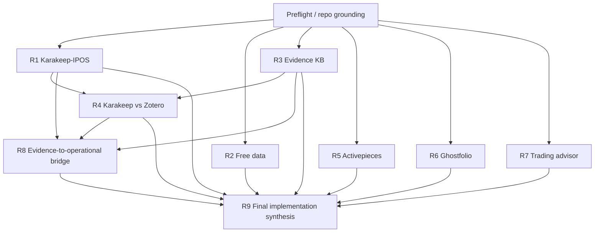

# AUTONOMOUS PROGRAM LAUNCHER — IPOS Reuse Expansion Research

**Repository:** `leela-spec/Investment`  
**Branch of record:** `main`  
**Mode:** ChatGPT Work lead-controller + bounded parallel research + independent review + final synthesis  
**Authority:** This launcher controls execution of the IPOS reuse-expansion research program. Individual track prompt files control the substantive requirements of their own tracks.

---

## 0. Mission

Execute the complete IPOS reuse-expansion research program from the authoritative research prompt files in the live repository, validate each track independently, correct failed tracks once, reconcile cross-track contradictions, and produce one implementation-ready synthesis.

The program exists to answer a narrow systems question:

> Which existing, proven, preferably free/local/deterministic products, skills, datasets and processes should be combined with the existing IPOS system, and what is the minimum justified custom IPOS glue between them?

This is **research and POC work**, not a license to redesign or implement the production IPOS system.

---

# 1. Non-negotiable operating rules

1. **Live repository wins.** Read `main` live before doing any research. Do not use conversation memory as project truth.
2. **Prompt files are contracts.** Execute each authoritative track prompt substantially as written. Do not compress away requirements because they look repetitive.
3. **Current implementation outranks stale planning prose.** When repo documents conflict, inspect executable code/tests/current decisions and explicitly record the conflict.
4. **Reuse before invention.** Search for existing products, libraries, datasets, skills, standards and workflows before recommending custom code.
5. **Primary-source-first.** Prefer official documentation, source repositories, licenses, APIs, release notes, regulators/public bodies and original research.
6. **No persuasive-but-uncited conclusions.** Every consequential external fact that affects a recommendation must be traceable to evidence.
7. **Separate evidence from judgment.** Clearly distinguish verified facts, inference, test result, operator preference, and recommendation.
8. **No silent production changes.** Research/POC writes are allowed only in the program result directory. Do not modify IPOS production code/config/scoring/playbook behavior.
9. **No real secrets or private portfolio data in POCs.** Use synthetic fixtures or explicitly non-sensitive test inputs.
10. **No autonomous trading.** Trading-advisor research is read-only advice architecture and validation.
11. **Bounded retries.** One targeted correction/re-review cycle per failed track. A second failure becomes a human gate.
12. **Persist state after every accepted track.** The program must be restartable from repository artifacts without this conversation.
13. **Do not block the whole program on one independent failure.** Continue any tracks whose dependencies remain satisfied.
14. **Do not start final synthesis until every required dependency is either ACCEPTED or explicitly waived by the operator.**
15. **Main only.** Do not create branches or worktrees.

---

# 2. Required preflight — do this before research

## 2.1 Pin the run

At run start record:

- current `main` commit SHA;
- UTC timestamp;
- complete recursive tree of the research-program area;
- authoritative prompt file paths and blob SHAs;
- current `PROJECT_STATE.md` SHA;
- current `05_blueprint/01_DECISION_ANALYSIS.md` SHA.

Write this to:

`05_blueprint/research/2026-08-23-ipos-reuse-expansion-program/results/RUN-MANIFEST.json`

Do not silently follow moving `main` after this point. If consequential new commits appear during the program:
- record them;
- decide whether they affect the research;
- if yes, re-ground only impacted tracks;
- never silently mix two repo states.

## 2.2 Discover the authoritative research prompts

Search the complete repository tree, not only GitHub code-search indexes.

Identify the prompt files for these intended tracks by `R#` identifier and substantive objective, regardless of exact filename:

- **R1** — Karakeep → IPOS integration/value/POC
- **R2** — complete free-data/source audit
- **R3** — general financial evidence knowledge base, skills and downloadable corpora
- **R4** — Karakeep vs Zotero implementation/interop test
- **R5** — Activepieces ingestion automation POC + alternatives
- **R6** — Ghostfolio POC + portfolio-tool alternatives
- **R7** — deterministic trading-advisor architecture from existing IPOS Playbook
- **R8** — evidence KB ↔ operational IPOS knowledge promotion/provenance bridge
- **R9** — final thin-glue implementation plan consuming R1–R8

For each discovered file record:
- track id;
- path;
- SHA;
- title/objective;
- required deliverables;
- declared prerequisites.

### Hard preflight gate

If any of R1–R8 is missing or ambiguous, do **not** improvise its prompt from memory. Mark the missing track `HUMAN_GATE_REQUIRED`, show exactly what was found, and ask the operator for the missing/ambiguous prompt.

If only R9 is missing, R1–R8 may still run, but final synthesis must wait.

## 2.3 Read project authority before delegating

Lead controller must read enough of the current project to prevent research drift. At minimum:

- `PROJECT_STATE.md`
- `05_blueprint/00_MASTER_PLAN.md`
- `05_blueprint/01_DECISION_ANALYSIS.md`
- `05_blueprint/03_PORTFOLIO_MODULE.md`
- `04_playbook/modules/*`
- `03_extract/indicators.jsonl`
- `03_extract/rules.jsonl`
- `03_extract/process.jsonl`
- `configs/*`
- relevant `ipos/` implementation and tests named by the track prompts
- `05_blueprint/research/2026-08-23-ipos-reuse-expansion-program/METHOD-BASIS.md`

Do **not** assume `HANDOVER.md` is current if it conflicts with executable state.

## 2.4 Build a visible program plan

Before launching workers, create:

`results/PROGRAM-PLAN.md`

containing:
- scope;
- track inventory;
- dependency DAG;
- parallel waves;
- POC/install operations expected;
- source strategy;
- review rubric;
- human gates;
- expected outputs;
- likely cross-track consistency questions.

Then continue autonomously. The operator need not approve routine source selection or track sequencing because this launcher already authorizes the program.

---

# 3. Dependency graph and execution waves

Use this default DAG unless the authoritative prompt files themselves establish a stricter dependency.



## Wave 0 — Preflight
Lead controller only.

## Wave 1 — maximum useful independent parallelism
Run **R1, R2, R3, R5, R6, R7** in parallel if Work supports independent workers; otherwise execute them sequentially in that order while preserving separate contexts/artifacts.

Rationale:
- these questions are materially independent;
- each has a different source universe;
- parallelism reduces latency without forcing workers to share mutable conclusions;
- no worker should wait for another merely to copy its opinion.

Target concurrency: **3–5 active researchers at once**. If six workers would create tool contention or context degradation, run two batches (e.g. R1/R2/R3 then R5/R6/R7).

## Wave 2 — dependent comparison
Run **R4** after R1 and R3 pass review.

R4 must use the accepted upstream factual findings as input, but must still verify product-specific claims itself where consequential.

## Wave 3 — governance bridge
Run **R8** after R1, R3 and R4 pass review.

## Wave 4 — cross-track consistency audit
Before R9, run an independent integration-review pass across accepted R1–R8 outputs. See §8.

## Wave 5 — final synthesis
Run **R9 only after**:
- every prerequisite track is ACCEPTED;
- cross-track consistency audit is ACCEPTED;
- unresolved human gates are either answered or explicitly waived.

---

# 4. Researcher contract for every track

For each R1–R8 worker, provide:

1. the **full authoritative track prompt**;
2. current pinned repo SHA;
3. the exact project files the track prompt requires;
4. this launcher's global rules;
5. result directory;
6. explicit instruction to avoid reading other tracks' recommendations unless they are a declared dependency.

This last rule reduces anchoring and correlated errors.

Each worker must first write a short internal track plan containing:
- questions/subquestions;
- repo evidence required;
- source categories;
- primary-source targets;
- POC/test plan if applicable;
- decision criteria/MCDA;
- expected deliverables.

Then execute the research.

## Progressive search pattern

Use:

`broad landscape → shortlist → primary-source verification → implementation details → adversarial/failure search → conclusion`

Do not:
- search the same generic query dozens of times;
- substitute SEO articles for official evidence when official evidence exists;
- conclude from GitHub stars alone;
- treat an untested integration claim as a verified implementation path.

## Source hierarchy

Default preference:

1. official product/library docs and source repo;
2. official license/security/API/release documentation;
3. regulators, public institutions, original datasets/research;
4. maintained technical docs/examples from the project;
5. high-quality independent technical evidence;
6. community discussion only for lived-experience/edge-case evidence.

Community evidence must not be the sole basis for licensing, API, security or deterministic-behavior claims.

## Currentness

For tools/products, verify current state as of the run date:
- latest release/commit activity;
- current license;
- current self-host/free-tier limits;
- current API/CLI/connector availability;
- deprecations or breaking changes.

## Evidence classification

Label material claims when useful as:
- `VERIFIED_PRIMARY`
- `VERIFIED_SECONDARY`
- `POC_OBSERVED`
- `INFERENCE`
- `UNVERIFIED`

Recommendations may rely on inference, but the underlying facts must remain visible.

---

# 5. POC and installation protocol

POCs are required only where the authoritative prompt calls for them.

## Allowed

- disposable local/container installation;
- synthetic test data;
- test accounts or fixtures;
- temporary adapters that do not enter production paths;
- exported flows/configs that contain no secrets;
- screenshots/logs/results sufficient to reproduce findings.

## Forbidden without explicit operator approval

- using real brokerage credentials;
- importing private portfolio files into third-party systems;
- modifying production IPOS scoring/playbook behavior;
- deploying public internet-facing services;
- paying for services;
- placing trades;
- enabling autonomous trading;
- storing secrets in Git.

## POC result standard

A POC is not `PASS` merely because installation succeeded.

Record:
- environment/version;
- commands/configuration;
- test dataset;
- expected behavior;
- observed behavior;
- failure/retry behavior;
- export/restore behavior where relevant;
- cleanup;
- reproducibility notes;
- blockers.

A blocked POC is a valid research result if the blocker is evidenced and the deterministic next test is documented.

---

# 6. Required track-result structure

Store all work under:

`05_blueprint/research/2026-08-23-ipos-reuse-expansion-program/results/<R#>-<slug>/`

Each accepted track must contain at least:

- the deliverables explicitly required by its authoritative prompt;
- `SOURCES.md` — source inventory grouped primary/secondary/community;
- `GAPS_AND_UNCERTAINTIES.md`;
- `TRACK-MANIFEST.json` with:
  - track id;
  - prompt path + SHA;
  - pinned repo SHA;
  - started/completed timestamps;
  - status;
  - reviewer score;
  - correction count;
  - output files;
  - POC status if applicable;
  - unresolved operator decisions.

Do not create duplicate prose files solely to satisfy this launcher if the authoritative prompt already requests an equivalent artifact; map the equivalent in `TRACK-MANIFEST.json`.

---

# 7. Independent review gate after every track

A different reasoning pass than the researcher must review each track.

Read:
- authoritative prompt;
- track outputs;
- cited sources;
- relevant current repo files.

Grade 0–2 per dimension from `METHOD-BASIS.md`:

1. repo grounding
2. factual grounding
3. citation accuracy
4. source quality
5. coverage
6. uncertainty
7. target alignment
8. reuse-first discipline
9. POC integrity (2 if not applicable and explicitly N/A)
10. efficiency

**Pass:** >=17/20 with no zero in repo grounding, factual grounding, citation accuracy or coverage.

Write:

`results/<track>/REVIEW.md`

including:
- score table;
- major claims spot-checked;
- unsupported/weak claims;
- missing requirements;
- drift/overengineering findings;
- verdict `ACCEPT` or `CORRECT`.

## Automatic correction

If `CORRECT`:
1. issue a narrow correction brief listing failed rubric items and exact deficiencies;
2. researcher repairs only those deficiencies;
3. reviewer re-runs the gate once.

If it fails again:
- status = `HUMAN_GATE_REQUIRED`;
- preserve the failed research and both reviews;
- do not fabricate acceptance;
- continue independent tracks.

---

# 8. Cross-track consistency audit

After R1–R8 have passed individually, a separate integration reviewer must reconcile them before R9.

Write:

`results/CROSS-TRACK-CONSISTENCY.md`

The audit must test at least:

## 8.1 Ownership conflicts

- Does Karakeep own raw evidence, dashboard, archive, or all three?
- If Zotero is recommended, does it have a non-overlapping canonical responsibility?
- Are the same PDFs/highlights/metadata being proposed as canonical in two systems?
- Does Ghostfolio duplicate an existing IPOS responsibility without measurable value?

## 8.2 Automation conflicts

- Does R5 introduce Activepieces/n8n/Node-RED into the IPOS **core**, despite research only justifying a sidecar?
- Does any recommendation accidentally make an always-on service load-bearing for weekly IPOS scoring?
- Does the free/local/source policy remain coherent with R2?

## 8.3 Evidence/operational-boundary conflicts

- Can new evidence silently alter numeric IPOS behavior?
- Are promotion/provenance rules from R8 compatible with current versioning/golden-test governance?
- Is semantic retrieval being proposed where deterministic metadata/FTS is sufficient?

## 8.4 Trading-advisor conflicts

- Does R7 reuse existing Playbook governance or invent a new strategy?
- Are production calculations separated from backtest/validation libraries?
- Is every numerical advisory rule reconstructible without an LLM?
- Is advice still read-only?

## 8.5 Portfolio conflicts

- Does the Ghostfolio recommendation preserve the existing CSV ingestion as fallback unless evidence says otherwise?
- Are current broker constraints reflected correctly?

## 8.6 Cost/license conflicts

- Do all `ADOPT NOW` components satisfy current free/local policy or explicitly identify the decision required to change it?
- Are open-source and source-available licenses distinguished correctly?

## 8.7 Custom-glue minimization

Build a table of every proposed custom component and ask:

> Can current IPOS, Karakeep, Zotero, Activepieces/n8n/Node-RED, Ghostfolio/alternative, TA-Lib/OpenAlgo, VectorBT, DuckDB, or another accepted existing system already perform this sufficiently?

If yes, remove or narrow the custom component before R9.

### Cross-track verdict

`ACCEPT` only when contradictions are resolved or explicitly elevated as operator decisions.

One targeted correction round across affected tracks is allowed if the audit finds resolvable inconsistencies.

---

# 9. Final R9 synthesis contract

R9 consumes only:
- current pinned repo state;
- accepted R1–R8 outputs;
- accepted cross-track consistency audit;
- operator answers to explicit gates.

R9 must not become a ninth broad landscape study.

It must produce the exact final implementation artifacts required by its prompt, and at minimum distinguish:

- `ADOPT_NOW`
- `TEST_FURTHER`
- `DEFER`
- `REJECT`

For every `ADOPT_NOW` item state:
- existing product/library reused;
- exact value supplied;
- exact IPOS boundary;
- custom glue still required;
- inputs/outputs/contracts;
- files likely affected;
- implementation sequence;
- tests;
- failure/degraded behavior;
- rollback/removal path;
- operator decision if any.

The final architecture must remain visibly divided into:

1. **Evidence acquisition/storage**
2. **Evidence → candidate knowledge → promotion**
3. **Existing IPOS operational knowledge/scoring**
4. **Portfolio ledger/integration**
5. **Deterministic advisory layer**
6. **Optional AI narration/explanation**

Never merge those responsibilities into an opaque "AI research system" box.

---

# 10. Human decision gates — only ask on these

The Work controller may act autonomously for normal planning, source selection, browsing, repository inspection, POC execution within the allowed sandbox, review, correction and synthesis.

Ask the operator only when one of these occurs:

1. an authoritative R1–R9 prompt is missing/ambiguous;
2. a required source/account cannot be accessed without user login/credential action;
3. a POC would require installing software outside an available disposable environment or altering the operator's production machine;
4. a POC requires real financial/private data;
5. a recommendation requires paid software/data and no free equivalent can answer the research question;
6. a second review fails after one correction cycle;
7. accepted tracks leave a genuine architectural choice with materially different user outcomes and no evidence-dominant option;
8. current repo decisions explicitly forbid a change that the evidence strongly recommends, requiring a conscious decision to amend the architecture;
9. an action would modify production IPOS behavior rather than research artifacts.

Do not ask for:
- permission to choose routine sources;
- permission to inspect relevant repo files;
- permission to retry a search;
- permission to run the independent review;
- permission to correct a failed draft once;
- permission to proceed to a dependency-ready track.

---

# 11. Program state machine

Maintain:

`results/PROGRAM-STATE.json`

Suggested shape:

```json
{
  "program": "ipos-reuse-expansion-2026-08-23",
  "pinned_repo_sha": "...",
  "status": "PREFLIGHT|RESEARCHING|REVIEWING|CONSISTENCY|SYNTHESIS|COMPLETE|HUMAN_GATE_REQUIRED",
  "tracks": {
    "R1": {"status": "PENDING", "prompt": null, "result_dir": null, "review_score": null, "corrections": 0},
    "R2": {"status": "PENDING", "prompt": null, "result_dir": null, "review_score": null, "corrections": 0},
    "R3": {"status": "PENDING", "prompt": null, "result_dir": null, "review_score": null, "corrections": 0},
    "R4": {"status": "BLOCKED_DEPENDENCY", "prompt": null, "result_dir": null, "review_score": null, "corrections": 0},
    "R5": {"status": "PENDING", "prompt": null, "result_dir": null, "review_score": null, "corrections": 0},
    "R6": {"status": "PENDING", "prompt": null, "result_dir": null, "review_score": null, "corrections": 0},
    "R7": {"status": "PENDING", "prompt": null, "result_dir": null, "review_score": null, "corrections": 0},
    "R8": {"status": "BLOCKED_DEPENDENCY", "prompt": null, "result_dir": null, "review_score": null, "corrections": 0},
    "R9": {"status": "BLOCKED_DEPENDENCY", "prompt": null, "result_dir": null, "review_score": null, "corrections": 0}
  },
  "human_gates": [],
  "cross_track_review": {"status": "PENDING"},
  "final_outputs": []
}
```

Update it after every meaningful transition.

---

# 12. Efficiency / anti-drift controls

## Stop conditions for a research subquestion

Stop searching when:
- the relevant current primary source has been found and verified;
- at least one independent corroboration exists for a contested/high-risk claim where appropriate;
- further sources repeat the same fact without changing confidence;
- the prompt's decision criterion can be scored honestly.

Continue searching when:
- only stale/secondary evidence exists;
- licensing/free-tier/API status is ambiguous;
- product behavior is claimed but not documented/tested;
- alternatives were not actually compared;
- a recommendation depends on a single fragile source.

## Context discipline

Workers receive only:
- their authoritative prompt;
- necessary project files;
- necessary accepted dependency outputs;
- launcher global rules.

Do not feed every repo file and every other track's prose into every worker.

## Output discipline

- Tables for option/source matrices.
- Machine-readable JSON/CSV where prompt requests it.
- Concise prose around evidence and decisions.
- Avoid long narrative descriptions that do not affect a decision.
- Keep source inventories separate from recommendation prose.

## Independence discipline

For independent Wave-1 tracks, do not expose them to other workers' recommendations before their own conclusion. Cross-pollination happens during the consistency phase, not during independent evidence collection.

---

# 13. Completion gate

The program is `COMPLETE` only if all of the following exist and pass review:

- `RUN-MANIFEST.json`
- `PROGRAM-PLAN.md`
- accepted outputs + review for R1–R8
- `CROSS-TRACK-CONSISTENCY.md`
- R9 final implementation outputs
- `PROGRAM-STATE.json` with status `COMPLETE`
- `FINAL-EXECUTIVE-SUMMARY.md`

`FINAL-EXECUTIVE-SUMMARY.md` must answer in one page:

1. What existing components should IPOS adopt?
2. What should IPOS explicitly reject/defer?
3. What exact custom glue remains justified?
4. What is the recommended implementation order?
5. Which decisions still require the operator?
6. What was actually POC-tested versus only researched?
7. What are the top unresolved risks?

Do not mark complete with missing tracks, unreviewed POCs, or unresolved dependency contradictions.
