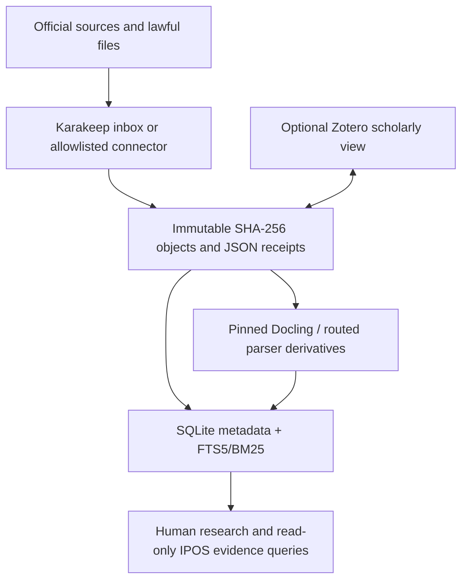

# KB Architecture Options

## Shared evaluation assumptions

- One serious personal/local research system, not a multi-tenant enterprise search service.
- Originals and acquisition metadata must survive application replacement.
- Existing IPOS operational DuckDB, extracts, playbook and scoring stay separate.
- Baseline retrieval must work offline without an LLM or embeddings.
- Scores are design judgments supported by the tool/corpus evidence, not benchmark measurements. They are therefore directional; run the acceptance tests before implementation commitment.

## Comparison

| Option | Canonical truth | Capture/annotation | Retrieval | Preservation/export | Key failure mode | Weighted score |
|---|---|---|---|---|---|---:|
| A. Karakeep-centric | Karakeep bookmark/assets/database | Strong web/PDF inbox, notes, tags, highlights | App full text + filters/API | Backups/assets available, but neutral manifest/hash lineage requires export | Application semantics and capture outputs become implicit provenance | 80 |
| B. Zotero-centric | Zotero library/storage | Excellent papers, metadata, annotations/citations | Metadata + limited attachment FTS | Data-directory backup is strong; export is explicitly not backup | Poor fit for broad datasets, web versions and non-scholarly formats | 84 |
| C. Karakeep + Zotero | Two application libraries | Best combined human workflows | Two searches/APIs unless synchronized | Each has backup/export, but cross-ID/version ownership is custom | Dual canonical state, duplicate attachments/tags and sync conflicts | 89 |
| D. Filesystem/Markdown + deterministic search | Immutable files/JSON manifests | Manual/drop-folder; any editor for notes | SQLite FTS5/BM25 + exact metadata/entities | Excellent portability and rebuildability | Capture/review friction and more small glue | 92 |
| E. Hybrid evidence store + local search | Immutable file objects + JSON manifest; SQLite is rebuildable index | Karakeep capture/review; Zotero optional for papers | SQLite FTS5/BM25 + relational tags/entities; optional app search | Best: neutral originals/receipts/derivatives, app-independent export | Boundary discipline and modest integration testing required | **97** |

## A. Karakeep-centric evidence library

**Shape:** Karakeep owns bookmarks, captures, assets, tags, notes and search; backups are the recovery path; consumers call its API/MCP.

**Advantages:** fastest usable web inbox; screenshots/archives/attachments and notes/highlights; API automation; local/free AGPL deployment; good general breadth.

**Deficiencies:** bookmark/application identity is not sufficient content/version identity; capture metadata and parser versions need augmentation; evidence export becomes coupled to application schema; structured datasets and authoritative financial IDs are awkward; source-derived versus model-generated tags can blur.

**Retrieval:** acceptable FTS and application filters. Deterministic entity lookup requires custom tag conventions/alias tables. Embeddings add no justified baseline value.

**Conclusion:** good interface, insufficient sole evidence substrate.

## B. Zotero-centric evidence library

**Shape:** Zotero owns collections, bibliographic records, snapshots/PDFs, notes and citations; its connector/translators ingest scholarly/web material.

**Advantages:** best mature citation metadata and bibliographic workflow; local data directory; tested translators; DOI/citation/export ecosystem; mature desktop UX.

**Deficiencies:** official index covers PDF/EPUB/HTML/plain text, not DOCX/ODT, and defaults to a character cap; corporate releases, datasets, mutable web pages and XBRL are not natural first-class evidence; official docs warn export is not backup.

**Retrieval:** good bibliographic metadata and attachment content for supported types, weaker general structured filters/BM25 control. Deterministic financial entity lookup needs extra fields/tags. Embeddings unnecessary.

**Conclusion:** strong scholarly side workspace, not general canonical evidence store.

## C. Karakeep + Zotero

**Shape:** Karakeep handles web/inbox material; Zotero handles academic sources; a bridge duplicates or links items.

**Advantages:** excellent human workflows across both evidence classes; mature capture and citation systems; little UI development.

**Deficiencies:** without a neutral store, both can appear canonical. Deciding attachment ownership, source-of-truth metadata, deletions, duplicate handling and ID reconciliation becomes more custom work than expected. Search is split. Backups restore two independently evolving databases.

**Retrieval:** combined coverage is high but federated ranking/dedup is custom. Deterministic tags/entities can diverge. Embeddings would mask rather than solve identity conflict.

**Conclusion:** better capability than either alone, but dual-canonical design violates simplicity. It becomes acceptable only when both are views over option E.

## D. Filesystem/Markdown + deterministic search

**Shape:** originals live in content-addressed directories, JSON/Markdown sidecars store metadata/notes, and SQLite FTS5 indexes normalized text.

**Advantages:** maximum portability, provenance, preservation, version control and offline operation; no service; easy hashing/backups; relational identifiers and FTS/BM25 are explicit; parser outputs rebuild cleanly.

**Deficiencies:** raw Markdown is not enough for binary/dataset metadata; requires JSON schema and a small CLI; no strong capture/triage UI; annotations and source views are less polished.

**Retrieval:** strongest deterministic control: FTS5/BM25 for content; SQL filters for metadata; join tables for tags/entities; saved queries for repeatability. An optional embedding table/index can be regenerated later without changing identities.

**Conclusion:** technically excellent and the right canonical layer, but pure D sacrifices too much user capture convenience.

## E. Hybrid evidence store + local search index

**Shape:** option D is canonical. Karakeep is the preferred inbox/capture/review view. A bounded exporter writes accepted assets and receipts into the neutral store. Zotero is optional for academic work and stores/links the neutral `evidence_id`. Docling produces versioned derivatives; SQLite FTS5 is the unified search. Other parsers are routed only by need.

**Advantages:** separates preservation, capture, parsing, search and scholarly workflows; each component is replaceable; deterministic baseline; broad format support; highest provenance; neutral backup/restore; best fit with IPOS “code computes, LLM narrates.”

**Deficiencies:** requires a manifest schema, idempotent exporters/importers and acceptance tests. The operator must enforce one-way or explicitly reconciled data ownership. This is modest glue, not zero glue.

**Retrieval:** one authoritative retrieval layer combines:

1. SQLite FTS5/BM25 over title, normalized text and selected notes;
2. relational filters for publisher/type/date/jurisdiction/rights/status;
3. exact tables for DOI/accession/CIK/LEI/dataset IDs and reviewed aliases;
4. version/attachment/citation edges;
5. optional embeddings as a separately versioned candidate-recall index only.

**Conclusion:** recommended.

## Target topology

Zotero interchange in the diagram is controlled by neutral IDs/hashes; it is not an unrestricted two-way database sync.

## Retrieval comparison

| Method | Baseline role | Deterministic? | Required? | Notes |
|---|---|---:|---:|---|
| FTS5/BM25 | Keyword/phrase/prefix search and ranking | Yes with pinned tokenizer/config/data | Yes | Transparent, offline, fast enough until benchmark disproves |
| Metadata filtering | Publisher/type/date/rights/status/parser/source | Yes | Yes | Primary way to narrow source quality and licensing |
| Deterministic tag/entity lookup | CIK/LEI/DOI/accession/series plus reviewed aliases | Yes | Yes | Never infer a ticker as canonical without source-backed mapping |
| Citation/relationship traversal | Version, attachment, cites, supersedes, derived-from | Yes | Yes | Supports audit and document lineage |
| Embeddings/vector retrieval | Optional semantic candidate recall/reranking | Model-dependent | No | Store model/version; never the only index or provenance layer |
| LLM answer generation | Optional synthesis over returned sources | No | No | Must cite exact evidence IDs/anchors; output is derived |

## Why embeddings/RAG are not assumed

The current IPOS corpus is small enough for deterministic playbook references and its blueprint intentionally avoids RAG. The evidence sidecar adds larger text, but exact financial identifiers, dates, publishers, document types and phrases carry unusually high retrieval value. FTS5/BM25 plus metadata provides inspectable failure modes and no model lifecycle. Add embeddings only after a query set shows a material recall gap that metadata, aliases, stemming or query expansion cannot solve; benchmark quality, storage and rebuild cost against that fixed set.

## Sensitivity

Option E leads D by five points. If Karakeep integration proved unreliable, E can degrade to D without data loss. If the operator values zero glue above capture automation, D could be chosen. Neither A nor B closes the provenance/export requirements alone. C gains user capability but its maintenance score remains low until re-framed as UI views over E.

