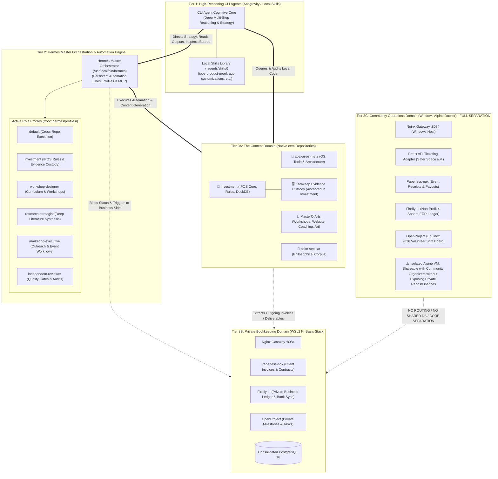
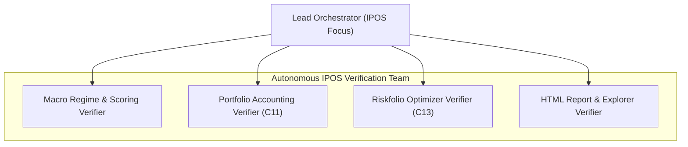

# Autonomous Multi-Agent Handover: Automation Architecture, 10 Workflows & Simulation Test Suite

**Date:** 2026-09-07  
**Prepared For:** Autonomous Multi-Agent Orchestration Team (Next Chat Session)  
**Execution Authority:** Multi-Agent CLI Team (Lead Orchestrator, Infra Verifier, IPOS Verifier, Community Verifier)  
**System Scope:** Three-Tier Cognitive Architecture, Clean Separation of Content vs. Bookkeeping, Isolated Community Alpine Stack, 10 Verified Workflows, and Autonomous Execution Protocol.

---

## 1. The Three-Tier Cognitive & Operational Architecture

The system operates across three strictly delineated layers of cognition and responsibility:

### Key Architectural Truths:
1. **CLI Agents = The Cognitive Brain**:
   * CLI agents possess high-reasoning capacity and execute deep research, complex refactors, and strategic synthesis.
   * They access local skills (`.agents/skills/`), inspect Hermes logs, review OpenProject Kanban boards, and direct Hermes automation.
2. **Hermes = The Persistent Automation Line**:
   * Hermes maintains long-running state, role profiles, crons, and MCP tool connections.
   * It handles scheduled executions, repetitive pipelines, and programmatic queries.
3. **Content vs. Bookkeeping Division**:
   * **Content Side (Hermes + ext4 Repos)**: Workshops, website creation, ideas, research pipelines, algorithmic backtests.
   * **Bookkeeping Side (KI-Basis)**: Strictly the receiving end for invoices, banking reconciliation, and administrative accounting.
4. **Community Operations Quarantined in Alpine Docker**:
   * The Equinox 2026 ticketing, Safer Space e.V. non-profit accounting, and volunteer shift planning live **strictly in the Windows Alpine Docker Desktop environment**.
   * It is 100% segregated so it can be shared with club collaborators without ever exposing private source code or personal business financials.

---

## 2. Execution Reality: Schedulers, Offline Queues & Catch-Up Mechanics

### 1. Who Initiates and Holds the Automation?
* **Windows Task Scheduler (`scripts/register_scheduler.ps1`)**:
  Holds `IPOS Weekly Pipeline`. Configured with `-StartWhenAvailable` to catch up missed runs.
* **Linux Cron / Systemd (`scripts/run_weekly_cron.sh`)**:
  Executes in Ubuntu WSL2 under `flock -n /tmp/ipos-weekly.lock` to prevent concurrent database writes.
* **Hermes Event Loop (`ki-basis-hermes`)**:
  Listens for incoming webhooks and API triggers on `127.0.0.1:8642`.

### 2. What Happens When the Laptop is Offline or Asleep?
* **Hardware State**: Local CPU is paused during sleep/off states.
* **Windows Scheduler Catch-Up**:
  If the laptop was asleep during the 05:00 Saturday schedule, Windows detects the missed event upon wake and triggers the pipeline immediately.
* **Telegram Cloud Message Queue**:
  Telegram Bot API servers store messages for 24+ hours. When `hermes_telegram_intake.py` reconnects, it retrieves updates with the last known `offset`, processing all missed receipts and ideas in chronological order without loss.
* **Pretix Cloud Queue**:
  Pretix retains all ticket sales and transaction logs in the cloud. Upon reconnection, `pretix_adapter.py` queries by timestamp and reconciles the backlog into Firefly III and Paperless.

---

## 3. Workflow Relocation & Retained IPOS Runbooks

To eliminate domain pollution and maintain strict repository sovereignty, the non-investment workflows have been moved to their respective sibling repositories with dedicated README index files:

| Workflow | Title | New Authoritative Location |
|---|---|---|
| **MPP-001** | Autonomous Multi-Agent Sequential Test Plan | `C:\GitDev\apexai-os-meta\docs\plans\00_META_PROGRAM_PLAN.md` |
| **WF-01** | Weekly Meta-Orchestration Sweep | `C:\GitDev\apexai-os-meta\docs\workflows\WF01_WEEKLY_META_ORCHESTRATION.md` |
| **WF-02** | Creative Writing & Thematic Synthesis | `C:\GitDev\MasterOfArts\docs\workflows\WF02_CREATIVE_WRITING_SYNTHESIS.md` |
| **WF-03** | "Transcendents" Workshop Concept | `C:\GitDev\MasterOfArts\workshops\plans\WF03_TRANSCENDENTS_WORKSHOP_CONCEPT.md` |
| **WF-04** | Business Website Multi-Variant Pipeline | `C:\GitDev\MasterOfArts\WEbsite\WF04_MOA_BUSINESS_WEBSITE_PIPELINE.md` |
| **WF-07** | Coaching Onboarding & Invoicing | `C:\GitDev\MasterOfArts\Coaching\WF07_COACHING_LIFECYCLE_INVOICING.md` |
| **WF-08** | Equinox 2026 Pretix Ticketing Settlement | `C:\GitDev\lika-community\docs\workflows\WF08_EQUINOX_PRETIX_TICKETING.md` |
| **WF-09** | Telegram Bot Offline Intake | `C:\GitDev\lika-community\docs\workflows\WF09_TELEGRAM_BOT_OFFLINE_INTAKE.md` |
| **WF-10** | Secular Corpus Cross-Referencing | `C:\GitDev\acim-secular\docs\workflows\WF10_ACIM_SECULAR_CROSS_REFERENCE.md` |

### Retained IPOS Operational Procedures (in `00_runbook/`):
- **[`WF05_IPOS_WEEKLY_MACRO_REGIME.md`](../../../00_runbook/WF05_IPOS_WEEKLY_MACRO_REGIME.md)**: Saturday 05:00 22-indicator macro regime calculation via DuckDB and rule engine.
- **[`WF06_IPOS_EVIDENCE_CUSTODY_WATCHDOG.md`](../../../00_runbook/WF06_IPOS_EVIDENCE_CUSTODY_WATCHDOG.md)**: Karakeep research custody watchdog archiving financial research artifacts with cryptographic receipts.

---

## 4. Multi-Agent Autonomous Simulation & Test Protocol (IPOS Focus)

**Instructions for the incoming Multi-Agent Team:**
Do NOT ask the operator to run terminal commands manually. Execute, observe, and verify the following IPOS test battery autonomously:

### Agent Runbook: 5 Autonomous IPOS Test Tasks

#### Task 1: Macro Regime & Scoring Deterministic Test Suite (Assigned to: MacroAgent)
* **Command**: `C:\GitDev\Investment\.venv\Scripts\python.exe -m pytest -q tests/test_regime.py tests/test_scoring.py`
* **Pass Criteria**:
  - All test cases pass (100% pass rate) in < 30 seconds.
  - Regime classifier deterministically outputs CHOPPY, TRENDY, or MOMENTUM based on golden fixtures.

#### Task 2: Portfolio Normalizer & Reconciliation Engine Suite (Assigned to: NormalizerAgent)
* **Command**: `C:\GitDev\Investment\.venv\Scripts\python.exe -m pytest -q tests/test_m11_normalizer.py tests/test_stop_gate.py`
* **Pass Criteria**:
  - Validates FIFO book cost basis, multi-currency conversions (EUR/USD), and control matrix checks.
  - Stop-gate fails closed on arithmetic discrepancies.

#### Task 3: Riskfolio-Lib Quantitative Optimization Suite (Assigned to: OptimizerAgent)
* **Command**: `C:\GitDev\Investment\.venv\Scripts\python.exe -m pytest -q tests/test_m13_optimizer.py`
* **Pass Criteria**:
  - Proves real Riskfolio-Lib execution (HRP, Min-Risk, Max Sharpe).
  - Validates socket blocking (offline invariant) and constraints sum to 1.0.

#### Task 4: Contradiction Detection & Historical Replay Suite (Assigned to: MacroAgent)
* **Command**: `C:\GitDev\Investment\.venv\Scripts\python.exe -m pytest -q tests/test_contradictions.py tests/test_replay.py`
* **Pass Criteria**:
  - Verifies inter-market macro contradiction rules (Credit vs Equity, Yield Curve vs Stance).
  - Historical replay produces deterministic point-in-time snapshots.

#### Task 5: Static Report & Macro Risk Explorer Verification (Assigned to: ReportingAgent)
* **Command**: `C:\GitDev\Investment\.venv\Scripts\python.exe -m pytest -q tests/test_report_html.py`
* **Pass Criteria**:
  - Generates self-contained static HTML report (`report.html`).
  - Validates all report sections without network leakage.
