# Handover: Automation Pipelines, Execution Reality, and 10 Concrete Workflows

**Date:** 2026-09-07  
**Prepared For:** Autonomous Test Agents, Subsequent Chat Sessions & Systems Architect  
**Scope:** Physical Automation Execution Mechanics, Coaching Customer Pipeline, Two IPOS Automation Pipelines, 10 Cross-Repository Workflows, and an Executable Test Suite.

---

## 1. Physical Automation Execution Reality & Hardware Contract

To eliminate any ambiguity or wishful thinking regarding how automation actually executes on your hardware:

### Q1: Who holds the cron jobs and schedulers?
Automation is driven across three specific layers:
1. **Windows Task Scheduler (Host Level)**:
   * Script: `scripts/register_scheduler.ps1` in `Investment`.
   * Holds the scheduled task `IPOS Weekly Pipeline`.
   * Runs natively under Windows with the user's interactive token.
2. **Linux Cron / Systemd Timers (WSL2 Level)**:
   * Script: `scripts/run_weekly_cron.sh` in `Investment` / `apexai-os-meta`.
   * Can be registered as a systemd timer (`/etc/systemd/system/ipos-weekly.timer`) or crontab in Ubuntu WSL2.
   * Features a kernel file-lock (`flock -n /tmp/ipos-weekly.lock`) to prevent concurrent runs from interleaving DuckDB writes.
3. **Docker Internal Schedulers (KI-Basis Container Level)**:
   * Paperless-ngx: Internal consume watcher polling `/usr/src/paperless/consume`.
   * OpenProject: Internal worker daemon (`delayed_job` / Puma) executing background notification sweeps.
   * Hermes Gateway (`ki-basis-hermes`): Async event loop listening on `127.0.0.1:8642`.

---

### Q2: Does the laptop need to be running? What happens when it is closed, asleep, or offline?
* **Hardware Reality**: The local CPU and RAM cannot execute code when the laptop is closed, sleeping (S3/Modern Standby), or powered off.
* **How Scheduled Tasks Catch Up (-StartWhenAvailable)**:
  - In `register_scheduler.ps1`, the task is configured with:
    ```powershell
    $Settings = New-ScheduledTaskSettingsSet `
        -StartWhenAvailable `
        -DontStopIfGoingOnBatteries `
        -AllowStartIfOnBatteries `
        -ExecutionTimeLimit (New-TimeSpan -Hours 2) `
        -MultipleInstances IgnoreNew
    ```
  - **The Catch-Up Mechanic**: If the laptop was asleep at 05:00 on Saturday, Windows Task Scheduler records that a trigger was missed. The instant the laptop is opened and wakes up, Windows triggers the missed run immediately.
* **How Telegram Messages Catch Up (Telegram Cloud Buffer)**:
  - Telegram does **not** discard messages when your laptop is offline.
  - The Telegram Bot API maintains an update buffer on Telegram's cloud servers (retaining unacknowledged updates for 24+ hours).
  - When the laptop connects to the internet and `hermes_telegram_intake.py` starts, it calls Telegram's `getUpdates(offset=...)`.
  - Telegram delivers all messages, photos, and receipts posted during the offline period in sequential chronological order. Nothing is lost.
* **How Webhooks / Orders Catch Up (Pretix & Activepieces)**:
  - Pretix retains all orders and financial transactions in the cloud database.
  - Activepieces and `pretix_adapter.py` query the API with high-water marks (`modified_since` or order ID), pulling and settling any backlog upon reconnection.

---

## 2. Coaching Customer Lifecycle & Invoicing Pipeline

For your private coaching business, the operational pipeline spans `MasterOfArts` and `KI-Basis`:

```mermaid
flowchart LR
    subgraph S1 ["1. Concept & Offer"]
        Concept["Coaching Concept
(MasterOfArts/Coaching)"]
        HermesOffer["Hermes drafts Offer & Agreement
(workshop-designer profile)"]
        Concept --> HermesOffer
    end

    subgraph S2 ["2. Engagement & Booking"]
        ClientAccept["Client Accepts Offer"]
        Booking["Session Calendar Sync
(OpenProject Meetings)"]
        HermesOffer --> ClientAccept --> Booking
    end

    subgraph S3 ["3. Invoicing (§ 14 UStG)"]
        InvoiceGen["Generate Compliant PDF Invoice
(Sequential No, Steuernummer)"]
        PaperlessOut["Archive in Paperless-ngx
(Tag: COACHING-INVOICE-OUTGOING)"]
        Booking --> InvoiceGen --> PaperlessOut
    end

    subgraph S4 ["4. Payment & Automated Reminders"]
        BankIngest["GLS Bank Ingestion
(Firefly III)"]
        Match["Reconciliation Engine
Matches Invoice ID"]
        Watchdog{"Payment
Received in
14 Days?"}
        Reminder["Hermes Telegram/Email Draft:
Polite Payment Reminder"]
        Settled["Mark Invoice Paid & Closed
(Firefly & OpenProject)"]

        PaperlessOut --> BankIngest --> Match --> Watchdog
        Watchdog -- "NO" --> Reminder
        Watchdog -- "YES" --> Settled
    end
```



### The 5 Operational Stages:
1. **Concept & Offer Formulation**:
   - Location: `MasterOfArts/Coaching/Leela Coaching/` (e.g. customized curriculum per client).
   - Hermes activates `workshop-designer` to generate the session roadmap, learning objectives, and service contract.
2. **Engagement & Meeting Orchestration**:
   - Meeting dates recorded in OpenProject work packages under the client's milestone.
3. **Automated Invoice Generation**:
   - ReportLab / script generates a § 14 UStG compliant PDF invoice with sequential invoice ID (`INV-2026-XXXX`), VAT status, and bank details.
   - Pushed to Paperless-ngx (`http://127.0.0.1:8010`) with metadata: `client: Carlos`, `type: outgoing-invoice`.
4. **Bank Reconciliation in Firefly III**:
   - Incoming bank feed into Firefly III (`http://127.0.0.1:8086`).
   - Matching rule checks transfer description for `INV-2026-XXXX`.
5. **Payment Watchdog & Automated Reminders**:
   - A daily cron queries Firefly III for unpaid outgoing coaching invoices older than 14 days.
   - If unpaid, Hermes drafts a polite Telegram / email reminder for operator confirmation before dispatching.

---

## 3. Two Core IPOS Automation Pipelines (`Investment` Repo)

### Pipeline 1: Autonomous Saturday Macro Regime Pipeline
* **Who Initiates**: Windows Task Scheduler (`scripts/register_scheduler.ps1`) or WSL2 systemd (`scripts/run_weekly_cron.sh`).
* **Trigger Schedule**: Every Saturday at 05:00 local time (with `-StartWhenAvailable` catch-up).
* **Execution Flow**:
  1. `flock` secures `/tmp/ipos-weekly.lock` to prevent database collision.
  2. Python runner invokes `python -X utf8 -m ipos.run`.
  3. Pulls live data for the active 22 indicators (Yield Curve 10Y-2Y, HY Credit Spreads, Fed Net Liquidity, ISM PMI, CPI YoY).
  4. `ipos/advisor/rule_engine.py` evaluates all 126 seminar rules and 44 process steps.
  5. Computes composite Regime Score and writes immutable snapshot to DuckDB warehouse (`data/warehouse/`).
  6. Refreshes the Action/Watch Register (`data/action_watch_register.json`).
  7. Formats executive markdown report and sends summary notification to the operator's private Telegram channel.

### Pipeline 2: Research Evidence Custody & Thesis Invalidation Watchdog
* **Who Initiates**: Event-driven on URL/PDF drop or scheduled hourly RSS sweep.
* **Execution Flow**:
  1. Research document ingested into **Karakeep** anchored in `/root/workspaces/Investment/`.
  2. Karakeep archives full-page SingleFile capture, extracts text, and generates SHA-256 receipt.
  3. Hermes running under the **`investment` profile** retrieves the evidence text via read-only MCP (`http://localhost:3000`).
  4. **The Thesis Invalidation Gate**:
     - Hermes checks if the findings contradict active macro assumptions (e.g. Fed policy pivot, inflation re-acceleration).
     - If contradictory evidence is detected, Hermes raises an **Invalidation Flag** in the Watch Register.
     - Hermes is strictly prohibited by `SOUL.md` from placing broker trades. It creates an operator review item with direct citations to the Karakeep artifact.

---

## 4. 10 Concrete Workflow Ideas Across Repositories

### Workflow 1: Creative Writing & Thematic Synthesis Pipeline (`MasterOfArts`)
* **Stack**: Hermes CLI (`research-strategist` profile) + `MasterOfArts/Art/` & `MasterOfArts/Awakening/`.
* **Execution**: Hermes crawls internal research notes, cross-references philosophical treatises, and synthesizes draft chapters or artistic essays with zero web distraction.

### Workflow 2: Weekly Meta-Orchestration & Infrastructure Health Sweep (`apexai-os-meta`)
* **Stack**: Windows PowerShell / WSL2 bash + Docker CLI + Git.
* **Execution**: Every Sunday at 23:00, sweeps all 4 repositories: verifies git branch status (checks for uncommitted work), verifies Docker container health, runs `backup-stack.sh` on ext4 named volumes, and compiles `health-receipt.yaml`.

### Workflow 3: "Transcendents" Workshop Concept & Curriculum Generator (`MasterOfArts`)
* **Stack**: Hermes (`workshop-designer` profile) reading `acim-secular` into `MasterOfArts/workshops/`.
* **Execution**: Ingests non-dual philosophical concepts from `/root/workspaces/acim-secular/`, creates an 8-module weekend retreat syllabus with interactive exercises, time allocations, and reading lists, and saves it into `MasterOfArts/Coaching/`.

### Workflow 4: Multi-Variant Business Website Build & Edge Staging (`MasterOfArts`)
* **Stack**: Python script (`MasterOfArts/WEbsite/build_all_websites.py`) + Nginx Edge Gateway.
* **Execution**: Builds three distinct aesthetic variations ("Zen Minimalist", "Vibrant", "Modern") and serves them behind the local Nginx gateway (:8084), enabling instant operator design review.

### Workflow 5: IPOS Autonomous Saturday Indicator Run (`Investment`)
* **Stack**: Windows Task Scheduler + OpenBB + DuckDB + Telegram Bot.
* **Execution**: The end-to-end numeric macro pipeline computing the 22-indicator regime score, generating the weekly HTML/MD report, and alerting Telegram without touching broker accounts.

### Workflow 6: IPOS Evidence Custody & Thesis Invalidation Watchdog (`Investment`)
* **Stack**: Karakeep (`/root/workspaces/Investment/`) + Hermes `investment` profile MCP client.
* **Execution**: Automated watchdog verifying that newly ingested analyst reports and macro filings adhere to the 126 seminar rules and flagging counter-evidence before capital allocation decisions.

### Workflow 7: Private Coaching Client Lifecycle & Invoicing Watchdog (`apexai-os-meta` & `MasterOfArts`)
* **Stack**: Paperless-ngx (:8010) + Firefly III (:8086) + OpenProject (:8082).
* **Execution**: Bridges client proposal acceptance into automatic invoice creation, archives in Paperless, tracks bank settlement in Firefly, and alerts on overdue accounts.

### Workflow 8: Equinox 2026 Pretix Ticketing & Non-Profit Tax Settlement (`apexai-os-meta` Community Stack)
* **Stack**: `ki-basis/scripts/pretix_adapter.py` + Firefly III + Paperless-ngx.
* **Execution**: Connects Pretix API, splits gross ticket revenue into platform fees, gateway deductions, and net payout, archives the settlement PDF into Paperless, and logs double-entry bookings in Firefly across the 4 non-profit tax spheres.

### Workflow 9: Social Initiative Telegram Bot Intake & Offline Backlog Catch-Up (`apexai-os-meta`)
* **Stack**: `ki-basis/scripts/hermes_telegram_intake.py` + Telegram Bot API.
* **Execution**: Community volunteers upload receipts and ideas to the Telegram group. Even if the laptop was asleep for 12 hours, launching the bridge catches up all receipts, uploads them to Paperless (`STAGED-FOR-REVIEW`), and files OpenProject tasks.

### Workflow 10: `acim-secular` Semantic Corpus Cross-Referencing & Text Extraction (`acim-secular`)
* **Stack**: Hermes CLI (`default` profile) with SQLite FTS5 / grep tooling.
* **Execution**: Translates high-level inquiries ("forgiveness vs reconciliation", "fear as resistance") into precise citations and textual excerpts from the secular corpus, feeding directly into coaching and workshop materials.

---

## 5. Step-by-Step Executable Test Suite (For Subsequent Sessions)

Any agent or operator can run these 6 live verification tests immediately to prove the stack works end-to-end:

### Test 1: Verify Fundraiser Stack, Pretix Settlement & Multi-Service Integration
```powershell
python C:\GitDevpexai-os-meta\ki-basis\scriptserify_fundraiser_stack.py
```
*Expected Output*: Passes all 5 stages (Pretix ticketing calculation, staging file checks, OpenProject 24 work packages, Firefly 19 transactions, Paperless 10 documents) with `ALL AUDIT VERIFICATIONS PASSED WITH ZERO ERRORS!`.

---

### Test 2: Verify Dual-Instance Isolation & Port Boundaries
```powershell
python C:\GitDevpexai-os-meta\ki-basis\scriptserify_dual_isolation.py
```
*Expected Output*: Confirms zero port overlaps between private and community port bands.

---

### Test 3: Run Live IPOS Regime & Scoring Pytest Suite
```powershell
cd C:\GitDev\Investment
.venv\Scripts\python.exe -m pytest -q tests/test_regime.py tests/test_scoring.py
```
*Expected Output*: `17 passed in ~19s (100%)`.

---

### Test 4: Verify MasterOfArts Multi-Variant Website Build Pipeline
```powershell
cd C:\GitDev\MasterOfArts\WEbsite
python build_all_websites.py
```
*Expected Output*: Compiles `index.html` switchboard, generates `variation-a-zen`, `variation-b-vibrant`, and `variation-c-modern` static landing pages.

---

### Test 5: Verify Telegram Intake Bridge CLI Interface
```powershell
python C:\GitDevpexai-os-meta\ki-basis\scripts\hermes_telegram_intake.py --help
```
*Expected Output*: Displays intake options for staging receipts (`--receipt`), filing community tasks (`--task`), and managing OpenProject projects.

---

### Test 6: Verify Hermes Host CLI Cross-Workspace Direct Access
```bash
wsl -d Ubuntu -u root -e bash -c "/usr/local/bin/hermes --version && ls -la /root/workspaces"
```
*Expected Output*: Displays Hermes version (`v0.20.5`) and lists all 4 repositories (`apexai-os-meta`, `Investment`, `MasterOfArts`, `acim-secular`) on native ext4.
