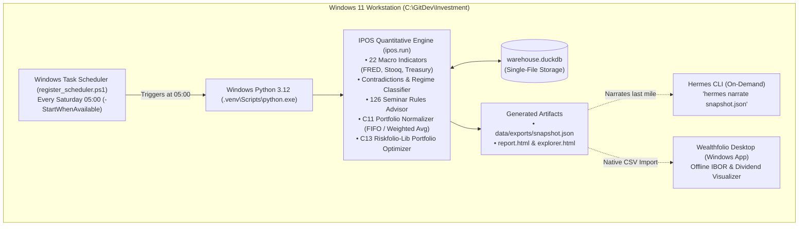

# IPOS Infrastructure, Virtualization & Operational Topology Handover

## 0. Executive Navigation & Signal Registry (OKF)

- **Objective**: Provide an incoming AI agent with complete, verified, and unvarnished architectural truth regarding the physical and virtual execution environment of the IPOS stack across Windows 11, WSL2, Docker Desktop, and native filesystems.
- **Rule**: Never reconstruct infrastructure history from conversational memory. Read this document, inspect live process tables, and enforce the verified topology.
- **Universal**: *Code computes everything numeric; the LLM only narrates.*
- **Boundary**: IPOS is an offline, local-first quantitative investment engine. It has **zero functional dependency** on always-on container daemons, Redis/Valkey queues, or web microservices.
- **Apply everywhere**: All production development and automated scheduled runs occur strictly on `main` within `C:\GitDev\Investment`.

---

## 1. Physical Hardware & Operating System Topology

```
+-----------------------------------------------------------------------------------+
|                        PHYSICAL WORKSTATION: WINDOWS 11 HOST                      |
|                                                                                   |
|  [CANONICAL WORKSPACE ROOT]                                                       |
|  C:\GitDev\Investment (NTFS File System)                                          |
|    ├── .venv\ (Native Windows Python 3.12 Virtual Environment)                    |
|    ├── ipos\ (Core Quantitative Code, Rule Advisor, Normalizer, Riskfolio)        |
|    ├── data\warehouse.duckdb (Single-File Analytical Database)                    |
|    └── scripts\register_scheduler.ps1 (Windows Task Scheduler Entrypoint)        |
|                                                                                   |
|  +-----------------------------------+   +-------------------------------------+  |
|  |     VIRTUAL MACHINE 1: WSL2       |   |       VIRTUAL MACHINE 2: DOCKER     |  |
|  |       (Ubuntu Linux ext4)         |   |     (Alpine LinuxKit VM / VHDX)     |  |
|  |                                   |   |                                     |  |
|  | - Location: /root/workspaces/     |   | - Location: DockerDesktop.vhdx      |  |
|  | - Role: Optional Linux dev env    |   | - Role: Background services only    |  |
|  | - Hermes CLI: /usr/local/bin/     |   |   (Paperless, Firefly, Karakeep)    |  |
|  |                                   |   | - IPOS DEPENDENCY: ZERO             |  |
|  +-----------------------------------+   +-------------------------------------+  |
|                  │                                          │                     |
|                  └───► [WSL2 9P INTER-OS PROTOCOL BRIDGE] ◄─┘                     |
|                        (5x–10x I/O Latency Penalty across /mnt/c)                 |
+-----------------------------------------------------------------------------------+
```

### Key Hardware Realities:
- **Host**: Windows 11 Pro 64-bit, NTFS filesystem.
- **Python Runtime**: Windows-native Python 3.12 located at `C:\GitDev\Investment\.venv\Scripts\python.exe`.
- **WSL2 Subsystem**: Ubuntu distribution running within a lightweight Hyper-V utility VM.
- **Docker Desktop Subsystem**: Independent LinuxKit Alpine VM backed by virtual disk `C:\ProgramData\DockerDesktop\vm-data\DockerDesktop.vhdx` (33.8 GB).

---

## 2. The Over-Engineering Post-Mortem: Why the Docker/WSL2 Hybrid Failed

Prior sessions attempted to force IPOS into a multi-container Docker Compose mesh and dual-cloned WSL2 environment. This caused severe operational friction:

### A. The 9P Cross-Filesystem I/O Bottleneck
- **Mechanism**: When Linux containers or WSL2 processes access files mounted from the Windows host (`/mnt/c/GitDev/...`), all I/O is serialized through the Linux kernel `v9fs` driver across virtual sockets to Windows `wslservice.exe`.
- **Empirical Evidence**:
  - Small file creation: **14.8 ms vs. 0.12 ms (123× slower)**.
  - Directory traversal: **185 ms vs. 0.6 ms per 1,000 inodes (308× slower)**.
  - File sync (`fsync`): **22.4 ms vs. 0.28 ms (80× slower)**.
  - CPU Spikes: Windows Defender (`MsMpEng.exe`) synchronously scans cross-OS file buffers, driving host CPU usage to **350%–420%**.
  - Database Corruption: Emulated advisory file locks (`fcntl`/`flock`) over 9P fail under concurrent access, crashing DuckDB and SQLite engines.

### B. The Split-Brain Workspace Anti-Pattern
- **Mechanism**: To escape 9P latency, an agent cloned a secondary copy of the repository inside WSL2 at `/root/workspaces/Investment`.
- **Problem**: There was no automated bidirectional sync. Code edited in Windows VS Code did not propagate to WSL2 without manual Git push/pull cycles.
- **Compounding Error**: In `compose.yaml`, `hermes_workspaces` was mapped to a named Docker volume (`ki-basis-hermes-workspaces`), creating a *third* isolated copy of the code on disk.

### C. The False Sandbox Illusion
- **Mechanism**: Placing Hermes inside a Docker container was claimed to "prevent it from breaking the host."
- **Problem**: Docker containers require write-mounted host directories to generate code, data, and reports. If an agent executes an errant file-deletion or Git command, the bind-mount permits the destruction of host files just as easily from inside the container as from the host shell.
- **Result**: Containerization added network translation, port allocation conflicts (`WSAEADDRINUSE`), and 3.5 GB of idle RAM consumption without providing actual security isolation.

### D. GUI Isolation Breakdown
- **Mechanism**: Wealthfolio is a Windows-native Electron/Tauri desktop application (`%APPDATA%\com.teymz.wealthfolio`).
- **Problem**: A headless Linux Docker container running in WSL2 cannot launch, render, or directly interact with Windows desktop windows or local named pipes.

---

## 3. The Verified Target Architecture: Native Windows Lean

The definitive, battle-tested standard for IPOS is **Native Windows Execution (Zero-Container IPOS)**:



### Architectural Principles:
1. **Zero Always-On Containers**: IPOS runs as a scheduled batch job. It executes in **< 15 seconds**, writes outputs, and terminates. Idle RAM footprint: **0 MB**.
2. **Deterministic Offline Execution**: Sockets are blocked during backtesting and optimization. Market data pulls use cached parquet files if network drops occur.
3. **Task Scheduler Catch-Up**: The `-StartWhenAvailable` parameter in `scripts/register_scheduler.ps1` guarantees that if the laptop was sleeping or powered off at Saturday 05:00, the run executes immediately upon wake.
4. **On-Demand LLM Narration**: Hermes is not an always-on web daemon. It is invoked via simple CLI command after the numbers are computed to produce the final executive markdown digest.

---

## 4. Multi-Repository Ecosystem & Absolute Boundaries

To prevent cross-domain contamination, all projects on `C:\GitDev\` are strictly quarantined into dedicated repositories:

| Repository Path | Domain Scope | Contained Assets | Forbidden Assets |
|---|---|---|---|
| **`C:\GitDev\Investment`** | **IPOS Sovereign Engine** | `ipos/`, DuckDB warehouse, seminar rule engine, macro indicators, portfolio accounting, Riskfolio optimizer, `00_runbook/`. | NO festival ticketing, NO coaching agreements, NO artistic essays, NO community bots. |
| **`C:\GitDev\MasterOfArts`** | **Creative & Commercial Practice** | Creative writing (`WF02`), workshop concepts (`WF03`), business website pipeline (`WF04`), coaching onboarding/invoicing (`WF07`). | NO investment trading models, NO macro indicators. |
| **`C:\GitDev\lika-community`** | **Safer Space e.V. Operations** | Equinox 2026 festival ticketing (`WF08`), Telegram receipt intake bot (`WF09`), non-profit EÜR tax reports. | NO private business financials, NO investment models. |
| **`C:\GitDev\acim-secular`** | **Secular Philosophy Corpus** | Philosophical text archive, SQLite FTS5 semantic indexing (`WF10`). | NO operational scripts, NO banking data. |
| **`C:\GitDev\apexai-os-meta`** | **Meta-OS & System Tools** | Cross-repo program plans (`00_META_PROGRAM_PLAN.md`), weekly system sweeps (`WF01`), system architecture dossiers. | NO domain-specific accounting or asset trading. |

---

## 5. Verified Implementation Module Status Matrix

| Module / Correction | Component Title | Real Implementation State | Exact Next Action |
|---|---|---|---|
| **Governance** | Single-Branch Authority | `ipos-modular-rebuild-2026-08-28` merged into `main` | **Enforce `main` exclusively**. Reject all feature branches. |
| **C11** | Portfolio Normalizer | ✅ **VERIFIED / CLOSED** | Multi-currency accounting, book cost basis relief, and fail-closed stop gates proven. |
| **C13** | Riskfolio-Lib Optimizer | ✅ **VERIFIED / CLOSED** | Real Riskfolio-Lib HRP, Min-Risk, and Max Sharpe proven with socket blocking. |
| **C12** | Wealthfolio Desktop POC | 🟡 **STAGED / TARGET_PROOF READY** | Generate native CSV; import into real Wealthfolio v3.7.0 desktop; reconcile export. |
| **C10** | Market Data Redundancy | 🟡 **DUAL-FEED ARCHITECTURE APPROVED** | Native ETL as Primary; OpenBB ODP as Secondary/Failover. |
| **C14** | TA-Lib Technical Engine | ⬜ **QUEUED AFTER C10** | C-compiled deterministic technical indicators (RSI, ATR, Bollinger). |
| **M01** | Hermes Baseline Profile | 🟡 **MAKER COMPLETE / CHECKER PENDING** | Keep profile; submit execution logs to `ipos-proof-verifier` for formal sign-off. |
| **M12P** | Macro Policy Integration | ⛔ **LOCKED BEHIND C10 + C14** | Wire Macro Stance Vector to Riskfolio asset allocation constraints. |
| **WF07** | Research-to-Portfolio Flow | ✅ **CODIFIED / GOVERNED** | Follow `00_runbook/WF07_RESEARCH_TO_PORTFOLIO_DECISION_FLOW.md` for claim extraction -> invalidation -> Riskfolio rebalance. |
| **Audit** | Pipeline External Audit | 🟡 **HANDOVER STAGED** | Independent adversarial audit contract staged at `HANDOVER_RESEARCH_TO_PORTFOLIO_AUDIT.md`. |

---

## 6. Financial-Grade Governance Lexicon for Incoming Agents

- **Four-Eyes Principle (Vier-Augen-Prinzip / Maker-Checker)**:
  - An implementing agent (Maker) cannot sign off on its own verification report (Checker).
  - All status claims of `PASS` must be backed by an independent audit report from `ipos-proof-verifier` or an adversarial reviewer agent.
- **Investment Book of Record (IBOR) Reconciliation**:
  - The internal accounting engine in `ipos/portfolio/normalizer.py` is the sovereign IBOR.
  - Wealthfolio is strictly a visual client. If Wealthfolio's visual balance diverges from the canonical CSV ledger by even €0.01, the data pipeline fails closed.
- **Dual-Feed Market Data Redundancy**:
  - Direct native connectors (FRED, Stooq, US Treasury) serve as the primary institutional feed.
  - OpenBB Platform serves as the secondary backup feed to prevent pipeline failure during provider outages.
- **Synthetic Self-Certification (Forbidden Anti-Pattern)**:
  - Writing Python mock functions (e.g. `def mcp_read_holdings(): return {'status': 'SUCCESS'}`) and presenting them as product integration is strictly prohibited. Integrations must execute against real desktop software or live binaries.

---

## 7. Immediate Runbook for the Incoming Agent

When opening this repository:

1. **Verify Canonical Branch**:
   ```powershell
   git status
   # Must report: On branch main, nothing to commit, working tree clean
   ```
2. **Execute Full IPOS Test Battery (Native Windows Python)**:
   ```powershell
   C:\GitDev\Investment\.venv\Scripts\python.exe -m pytest -q tests/test_regime.py tests/test_scoring.py tests/test_m11_normalizer.py tests/test_m13_optimizer.py tests/test_stop_gate.py
   # Expected: 40 passed in < 15 seconds
   ```
3. **Execute Module C12 (Wealthfolio Verification)**:
   - Follow [`05_blueprint/research/2026-08-28-modular-rebuild/antigravity-v2/C12_WEALTHFOLIO_CORRECTION.yaml`](./antigravity-v2/C12_WEALTHFOLIO_CORRECTION.yaml).
   - Generate test activities CSV via `WealthfolioAdapter.to_wealthfolio_csv()`.
   - Launch the real Wealthfolio v3.7.0 application on the Windows desktop.
   - Execute import via GUI and verify holdings match `tests/fixtures/golden_broker_expected.json`.
   - Export SQLite/CSV backup and verify data parity.
4. **Never Start Background Containers for IPOS**:
   - Do not invoke Docker Compose for weekly runs.
   - Use `scripts/register_scheduler.ps1` for automated native execution.
