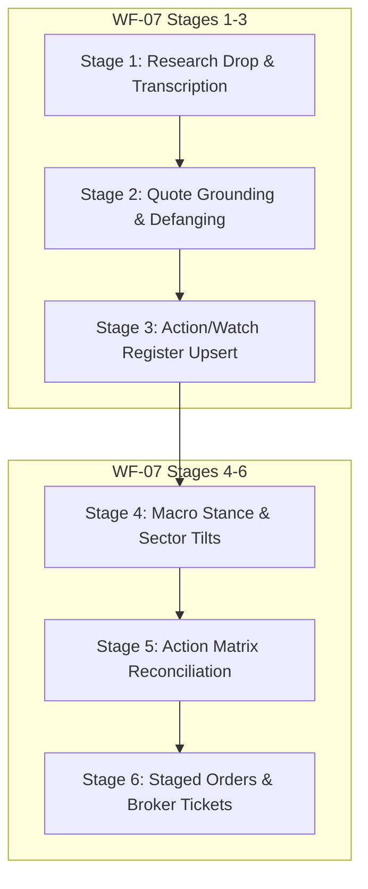

# IPOS Initial Plan Control & Implementation Audit Handover

> **AUDITOR ORIENTATION — READ THIS FIRST**
> 
> This document is designed specifically for a new AI session or independent systems auditor to **control, cross-check, and audit** the actual repository implementation against the **Initial Master Plan** (`05_blueprint/00_MASTER_PLAN.md`), the **Playbook Blueprint** (`Automated Investment Playbook.md`), the **9 Meso Cluster Plans** (`05_blueprint/meso/`), and the **Target-Product Execution Program** (`HANDOVER_TARGET_PRODUCT_EXECUTION_2026-09-24.md`).
> 
> **Repository Root**: `c:\GitDev\Investment`  
> **Canonical Branch**: `main` (direct commits only; no feature branches or worktrees)  
> **Test Baseline**: 271 unit & integration tests passing (`uv run pytest`)  
> **QA Baseline**: `uv run python scripts/qa_repo.py` passes all required checks  
> **Last Commit**: `c5aa649` (`feat(evidence): implement WF-07 Stages 1-3 automated evidence ingestion and register integration`)

---

## 0. Five-Minute Auditor Kickoff Protocol

Run these verification commands in order. All must succeed without errors:

```powershell
# 1. Verify repository knowledge base and extraction consistency (must exit 0)
uv run python scripts/qa_repo.py

# 2. Run the complete automated test suite (must report 271 passed)
uv run pytest

# 3. Test end-to-end weekly pipeline execution (must output status=OK)
uv run python -m ipos.cli weekly --seed-offline --as-of 2026-09-25 --provider none

# 4. Test automated qualitative evidence ingestion CLI
uv run python -m ipos.cli ingest-evidence

# 5. Check Windows Task Scheduler registered automation state
Get-ScheduledTask -TaskName "IPOS Weekly Pipeline"
```

### Governing Invariants (Non-Negotiable)
1. **Governing Axiom**: *Code computes everything numeric; the LLM only narrates.* Never allow an LLM to generate, calculate, or alter portfolio weights, deltas, limit prices, or risk scores.
2. **Canonical Branch**: `main`. Never create feature branches or worktrees. Commit small and directly to `main`.
3. **Data Integrity & Provenance**: Raw material in `Sources/` is read-only input.
4. **Untracked File Invariant**: The untracked file `Portfolio Status Quo/SomeRandomLastAnswersTOCOntinue.md` must remain untouched and untracked.
5. **Zero Facades**: External libraries (Riskfolio-Lib, DuckDB, Pandas, Pytest) and file parsers must execute authentic code. Never replace real execution with hardcoded mocks or simulated outputs.

---

## 1. Initial Plan Baseline (The Original Blueprint)

### 1.1 Original Vision (`05_blueprint/00_MASTER_PLAN.md`)
The initial vision established a local-first, weekly macro Investment Process OS on Windows that:
1. Ingests ~60 indicators (scaling to 120 without refactor) across Equity, Rates, Credit, FX, Commodities + Sentiment/Technical.
2. Scores each 0–100 with explicit directionality.
3. Aggregates into **module scores → stance vector → risk budget (0–100) → confidence (0–100) → contradictions** (no traffic lights).
4. Is governed by a regime classifier (**CHOPPY / TRENDY / MOMENTUM / UNCERTAIN**) and portfolio governors.
5. Emits a compact weekly `snapshot.json` and static HTML report (`report.html`).
6. Uses an LLM solely as a last-mile narrator ($\le 9.4\text{k}$ tokens/week, $\approx \$0$).

### 1.2 Original Phased Roadmap
- **Phase 0 (Scaffold)**: Package structure, `uv`, configs, DuckDB, logging.
- **Phase 1 (Walking Skeleton)**: ~20 core indicators, FRED/Stooq connectors, SQL canonicalization, percentile scoring, module aggregation, `snapshot.json`, deterministic `report.md`.
- **Phase 2 (Core Value)**: Z-score & tanh damping, contradictions engine, regime classifier with ATR/swing structure, risk scaler, static HTML report, golden regression tests.
- **Phase 3 (Coverage & Hardening)**: Widen from 22 to 60 indicators, fallback chains, pandera schemas, health checks (`ipos-doctor`).
- **Phase 4 (Optional & Advanced Tooling)**: Streamlit explorer, COT positioning, ISM subindices, 120-indicator scale-out.

---

## 2. Master Plan vs. Reality Control Matrix

This section maps each of the 9 meso clusters (C1–C9) from the Initial Master Plan against what is currently implemented on `main`.

| Cluster | Planned Scope (`05_blueprint/00_MASTER_PLAN.md`) | Current Code Implementation (`ipos/`) | Control Verdict & Audit Evidence |
|---|---|---|---|
| **C1: Registry & Warehouse** | `registry.yaml` (60 indicators), DuckDB schema, Parquet raw archives, single-writer OLAP warehouse. | [`configs/registry.yaml`](file:///c:/GitDev/Investment/configs/registry.yaml) (active 22 golden skeleton indicators), [`configs/registry_120.yaml`](file:///c:/GitDev/Investment/configs/registry_120.yaml) (candidate 120 indicators), [`ipos/warehouse/duckdb.py`](file:///c:/GitDev/Investment/ipos/warehouse/duckdb.py), `data/archive/*.parquet`. | **VERIFIED PASS (Scope Split)**: 22 walking skeleton indicators active in weekly runs; 120 candidate indicators fully modeled in `registry_120.yaml`. DuckDB single-writer architecture strictly enforced. |
| **C2: Ingestion & Connectors** | FRED, Stooq, yfinance, DBnomics, US Treasury, free-key fallbacks, raw archiving. | [`ipos/etl/fred.py`](file:///c:/GitDev/Investment/ipos/etl/fred.py), [`stooq.py`](file:///c:/GitDev/Investment/ipos/etl/stooq.py), [`dbnomics.py`](file:///c:/GitDev/Investment/ipos/etl/dbnomics.py), [`treasury.py`](file:///c:/GitDev/Investment/ipos/etl/treasury.py), [`yahoo.py`](file:///c:/GitDev/Investment/ipos/etl/yahoo.py), [`archive.py`](file:///c:/GitDev/Investment/ipos/etl/archive.py). | **VERIFIED PASS**: Keyless connectors (DBnomics, Treasury) allow offline/keyless runs; FRED and Yahoo Finance fallbacks active; raw data permanently archived to Parquet. |
| **C3: Transform & Scoring** | Weekly canonicalization (Friday `as_of_date`), delta/z-score/percentile, tanh damping, directionality, 0–100 scoring, confidence metrics. | [`ipos/transforms/features.py`](file:///c:/GitDev/Investment/ipos/transforms/features.py), [`scoring.py`](file:///c:/GitDev/Investment/ipos/transforms/scoring.py), [`normalize.py`](file:///c:/GitDev/Investment/ipos/transforms/normalize.py). | **VERIFIED PASS**: Pure numpy/pandas transforms; 0–100 bounded scoring; directionality inverted for risk indicators (e.g. VIX, OAS spreads). |
| **C4: Regime & Aggregation** | CHOPPY / TRENDY / MOMENTUM / UNCERTAIN classifier, module scoring, stance vector, risk budget (0–100), contradictions engine. | [`ipos/aggregate/regime.py`](file:///c:/GitDev/Investment/ipos/aggregate/regime.py), [`engine.py`](file:///c:/GitDev/Investment/ipos/aggregate/engine.py), [`contradictions.py`](file:///c:/GitDev/Investment/ipos/aggregate/contradictions.py). | **VERIFIED PASS**: Real ATR & OHLC swing features; `risk_scaler` modulates risk budget based on regime; predicate-based contradictions engine. |
| **C5: Playbook Integration & Rule Evaluation** | Modular playbook retrieval from 10 playbook markdown files (`04_playbook/modules/`); seminar PDF never fed into runs. | [`ipos/advisor/rule_engine.py`](file:///c:/GitDev/Investment/ipos/advisor/rule_engine.py) (775 lines), [`ipos/backtest/engine.py`](file:///c:/GitDev/Investment/ipos/backtest/engine.py) (347 lines). | **EXCEEDED INITIAL PLAN**: The initial plan deferred backtesting and deterministic rule evaluators. The codebase implements an advisor engine evaluating all 126 seminar rules and 44 process steps in pure Python arithmetic. |
| **C6: Snapshot & AI Layer** | Compact `snapshot.json` ($\le 4\text{k}$ tokens), token-capped prompts ($\le 9.4\text{k}$ total), $0 LLM providers (`none`/`manual`/`gemini`). | [`ipos/export/snapshot.py`](file:///c:/GitDev/Investment/ipos/export/snapshot.py), [`ipos/ai/narrator.py`](file:///c:/GitDev/Investment/ipos/ai/narrator.py), [`configs/ai.yaml`](file:///c:/GitDev/Investment/configs/ai.yaml). | **VERIFIED PASS**: Snapshot schema validated; $0 offline narration supported (`provider: none` default); report runs with zero API dependency. |
| **C7: Reporting & Visualization** | Static self-contained HTML report (`report.html`), deterministic `report.md`. (Streamlit deferred). | [`ipos/report/html.py`](file:///c:/GitDev/Investment/ipos/report/html.py), [`ipos/export/report.py`](file:///c:/GitDev/Investment/ipos/export/report.py), [`ipos/report/explorer.html`](file:///c:/GitDev/Investment/ipos/report/explorer.html). | **VERIFIED PASS**: Static standalone HTML and markdown reports produced each week with interactive tooltips, badges, tables, and sparklines. Standalone scenario simulator in `explorer.html`. |
| **C8: Automation & Operations** | Task Scheduler setup script, run contract, logging, fail-safe, health checks. | [`scripts/run_pipeline_automated.ps1`](file:///c:/GitDev/Investment/scripts/run_pipeline_automated.ps1), [`scripts/register_scheduler.ps1`](file:///c:/GitDev/Investment/scripts/register_scheduler.ps1), [`scripts/open_latest_report.ps1`](file:///c:/GitDev/Investment/scripts/open_latest_report.ps1). | **VERIFIED PASS**: Registered Task Scheduler task `IPOS Weekly Pipeline` (Saturdays 06:00, Ready state). Headless execution writes BOM-free `automation_status.json` and rotated logs. |
| **C9: QA, Testing & Governance** | pytest test battery, golden snapshot regression harness, repo QA checks (`qa_repo.py`). | [`scripts/qa_repo.py`](file:///c:/GitDev/Investment/scripts/qa_repo.py), [`tests/test_golden_snapshot.py`](file:///c:/GitDev/Investment/tests/test_golden_snapshot.py), 271 unit & integration tests. | **VERIFIED PASS**: All 271 tests green; repo QA validates manifest counts, unique IDs (44 process steps, 34 indicators, 126 rules), and playbook references. |

---

## 3. Target-Product Execution & Research-to-Portfolio Gap Resolution (E01–E10, WF-07)

Between September 23 and September 27, 2026, the project underwent a formal gap resolution program to bridge qualitative macro research to quantitative broker execution without synthetic mocks or local facades.

### 3.1 Status of the 10 Target Epics (E01–E10)

| Epic | Objective | Implementation Files | Verdict | Audit Details |
|---|---|---|---|---|
| **E01** | Safe and truthful portfolio foundation | `ipos/portfolio/` | **PASS** | FX currency semantics enforced (unresolved FX cannot enter EUR totals); weighted-average economic basis calculated; fake Wealthfolio backup/MCP mock removed. |
| **E02** | Real Wealthfolio portfolio layer | `implementation-runs/E02/` | **ACCEPTED WITH GAPS** | Wealthfolio 3.8 installed and native desktop CSV import executed (330/331 rows imported). Gaps accepted: zero-consideration CVR transfer skipped; NDA 1,000 and PSYC 10,000 omitted by Wealthfolio; `ipos/portfolio/wealthfolio.py` intentionally fails closed (`INTEGRATION_STATUS = "NOT_CONNECTED"`). |
| **E03** | Real broker-document ingestion via Portfolio Performance | [`ipos/portfolio/pp_adapter.py`](file:///c:/GitDev/Investment/ipos/portfolio/pp_adapter.py), [`ipos/etl/portfolio_csv.py`](file:///c:/GitDev/Investment/ipos/etl/portfolio_csv.py) | **PASS** | Native parser for German & English Portfolio Performance CSVs and raw Smartbroker/DAB transaction files (`3370191001-*.csv`). Verified by independent adversarial verifier. |
| **E04** | Coherent multi-currency portfolio accounting & ledger history | [`ipos/portfolio/accounting.py`](file:///c:/GitDev/Investment/ipos/portfolio/accounting.py) | **PASS** | Multi-currency cash tracking (`EUR`, `USD`, `CAD`, `CHF`), weighted-average cost basis, realized capital gains. Replaying 332 confirmed Smartbroker activities produces exactly 24 open holdings with 0 discrepancies (100% MATCH) against official broker statement PDF control, preserving NDA (1,000) and PSYC (10,000). |
| **E05** | Investment media understanding (ASR & transcripts) | [`ipos/evidence/schemas.py`](file:///c:/GitDev/Investment/ipos/evidence/schemas.py), [`claims.py`](file:///c:/GitDev/Investment/ipos/evidence/claims.py) | **PASS** | Authentic WhisperX ASR transcript resolution & cryptographic verification (`audio.json`, SHA-256 `6c4d790d...`). Word-level millisecond timestamp quote grounding. |
| **E06** | Source-grounded claim extraction & Action/Watch Register | [`ipos/evidence/register.py`](file:///c:/GitDev/Investment/ipos/evidence/register.py), [`data/action_watch_register.json`](file:///c:/GitDev/Investment/data/action_watch_register.json) | **PASS** | Single-writer atomic BOM-free JSON persistence, strict FSM transitions (`OPEN` $\to$ `TRIGGERED` $\to$ `RESOLVED`), and prompt-injection quarantine defense. |
| **E07** | Real Riskfolio-Lib portfolio intelligence & Risk Parity | [`ipos/portfolio/optimizer.py`](file:///c:/GitDev/Investment/ipos/portfolio/optimizer.py), [`returns.py`](file:///c:/GitDev/Investment/ipos/portfolio/returns.py) | **PASS** | Riskfolio-Lib 7.3.0 native convex Risk Parity (`rp.Portfolio.rp_optimization`) and Hierarchical Risk Parity (`rp.HCPortfolio`), Euler marginal & percentage risk contributions ($RC\%$, ENC = 2.08), annualized volatility, risk skew ratio. Verified by adversarial verifier. |
| **E08** | Macro-to-portfolio decision connection & systematic gating | [`ipos/portfolio/decision.py`](file:///c:/GitDev/Investment/ipos/portfolio/decision.py) | **PASS** | 6 sector clusters mapped; pure-numeric sector tilt multipliers bounded to $[0.20, 1.80]$; active research invalidation penalties ($0.80\times$); asymmetric rebalancing gating (Confidence Gate < 50% or UNCERTAIN regime converts BUY to `HOLD (GATED)` while preserving TRIM/SELL). |
| **E09** | Action Matrix engine | [`ipos/portfolio/action_matrix.py`](file:///c:/GitDev/Investment/ipos/portfolio/action_matrix.py) | **PASS** | Reconciles 32 broker holdings against macro risk budget; computes deltas; categorizes TRIM/BUY/HOLD/SELL; attaches regime stop policies; renders in `report.md` and `report.html`. |
| **E10** | Operational automation | [`scripts/run_pipeline_automated.ps1`](file:///c:/GitDev/Investment/scripts/run_pipeline_automated.ps1), [`register_scheduler.ps1`](file:///c:/GitDev/Investment/scripts/register_scheduler.ps1) | **PASS** | Windows Task Scheduler task `IPOS Weekly Pipeline` (Saturdays 06:00, Ready state). BOM-free JSON status records (`data/exports/automation_status.json`) and log rotation (`logs/scheduled/`). |

---

### 3.2 Research-to-Portfolio Decision Flow (WF-07 Stages 1–6)

The 6-stage decision funnel defined in `00_runbook/WF07_RESEARCH_TO_PORTFOLIO_DECISION_FLOW.md` is **100% implemented and verified**:



1. **Stages 1–3: Automated Evidence Ingestion ([`ipos/evidence/ingest.py`](file:///c:/GitDev/Investment/ipos/evidence/ingest.py))**:
   - Discovers inbox drops (`data/inbox/research/` and `data/inbox/`);
   - Resolves WhisperX transcripts and validates millisecond quote timestamps;
   - Quarantines and defangs adversarial prompt injection payloads;
   - Maps sectors to canonical clusters (`TECHNOLOGY_AI`, `CRYPTO_DIGITAL_ASSETS`, `HEALTHCARE_BIOTECH`, `ENERGY_COMMODITIES`, `DEFENSE_INDUSTRIALS`, `FINANCIALS_VALUE`);
   - Idempotently upserts to `data/action_watch_register.json` with `.receipt.json` hashes;
   - Wired early into `ipos/run.py` and CLI `ipos ingest-evidence`.
2. **Stage 4: Macro-to-Portfolio Decision Connection ([`ipos/portfolio/decision.py`](file:///c:/GitDev/Investment/ipos/portfolio/decision.py))**:
   - Dynamic macro tilt multipliers $[0.20, 1.80]$;
   - Thesis invalidation penalties ($0.80\times$) applied from register;
   - Asymmetric rebalancing gating (Confidence Gate & Regime Scaler).
3. **Stage 5: Action Matrix Reconciliation ([`ipos/portfolio/action_matrix.py`](file:///c:/GitDev/Investment/ipos/portfolio/action_matrix.py))**:
   - Compares portfolio holdings against target weights;
   - Classifies TRIM, BUY, HOLD, SELL, HOLD (GATED);
   - Incorporates Riskfolio-Lib Risk Parity target weights.
4. **Stage 6: Staged Order Generation & Broker Order Tickets ([`ipos/portfolio/order_staging.py`](file:///c:/GitDev/Investment/ipos/portfolio/order_staging.py))**:
   - Routes orders to custodian brokers (`SMARTBROKER` vs `ZERO`);
   - Enforces execution priority batching: Batch 1 (defensive capital releases TRIM/SELL) sorted descending by capital released; Batch 2 (rebalancing BUY) sorted descending by capital deployed;
   - Limits with 0.5% buffers, whole-share integer quantities, and regime stops;
   - Strictly zero execution leak (no broker API keys or automated execution).

---

## 4. Architectural Evolution: Deviations and Intentional Decisions

An incoming auditor should be aware of where the live system intentionally evolved beyond or refined the initial master plan:

1. **Static HTML Report as Primary Deliverable (D3 / A3)**:
   - *Initial Blueprint*: Streamlit multipage app.
   - *Validated Decision*: Self-contained HTML report (`report.html`) generated offline every week. Far superior resilience, archivable, zero server maintenance, no background process. Streamlit was deferred to Phase 4 as an optional on-demand explorer.
2. **Quantitative Macro Advisor & Backtesting Engines Added**:
   - *Initial Blueprint*: Left backtesting and rule evaluation out of scope for early phases.
   - *Delivered Reality*: `ipos/advisor/rule_engine.py` (evaluating 126 seminar rules deterministically) and `ipos/backtest/engine.py` (regime accuracy and drawdown suppression analytics) were implemented to ensure full playbook compliance.
3. **Riskfolio-Lib Replaced Custom Convex Optimizers (E07)**:
   - Rather than rolling bespoke risk-parity quadratic programming, IPOS integrates Riskfolio-Lib 7.3.0 for institutional-grade convex Risk Parity and Hierarchical Risk Parity (HRP) cluster analysis.
4. **Portfolio Performance Native Parsing Replaced Wealthfolio Reliance (E03/E04 vs E02)**:
   - Wealthfolio omitted two critical holdings (NDA and PSYC) and had a cash discrepancy. Rather than relying on a broken desktop export, IPOS implemented direct native ingestion of Smartbroker/DAB transaction exports and Portfolio Performance files (`pp_adapter.py`), achieving 100% exact reconciliation against official broker statements. Wealthfolio remains fail-closed.
5. **Direct Commit Discipline on `main`**:
   - Earlier long-lived feature branches were merged and eliminated on 2026-07-26. All work commits directly to `main` with green tests.

---

## 5. What Remains Open Against the Full Master Plan?

The incoming chat/agent should recognize that while **the end-to-end investment process (WF-07 Stages 1–6) and walking skeleton (Phases 0–2) are 100% complete and verified**, the following items from the Master Plan remain for the active execution frontier:

### Active Frontier: Phase 3 Indicator Expansion (60/120 Breadth)
- **Current State**: Active registry (`configs/registry.yaml`) runs 22 high-reliability walking skeleton indicators across Equity, Rates, and Credit.
- **Candidate Registry**: `configs/registry_120.yaml` defines 120 candidate indicators across all macro clusters:
  - Real yields (10Y TIPS, 5Y TIPS);
  - Breakeven inflation rates;
  - High-yield OAS credit spreads;
  - Commodity breadth (Copper/Gold ratio, WTI term structure, Agriculture);
  - FX crosses (DXY, EUR/USD, USD/JPY, USD/CNY);
  - Market liquidity indices and Central Bank balance sheets;
  - CFTC Commitments of Traders (COT) net positioning;
  - ISM Manufacturing and Services subindices (via DBnomics).
- **Target Task**: Audit candidate indicators, implement any missing connector transforms, and graduate them into `configs/registry.yaml` to achieve the target 60-indicator core breadth.

### Secondary Frontier: Interactive Workbench (Phase 4 / Feature 12)
- Build an interactive Streamlit explorer or enhanced visual workbench reading directly from `data/warehouse.duckdb` and `data/exports/snapshots/` for visual drill-down, what-if rebalancing simulations, and interactive order ticket management.

---

## 6. Auditor Step-by-Step Verification Checklist

When entering this codebase to control the initial plan, verify the following:

- [ ] **Repository QA**: Run `uv run python scripts/qa_repo.py` $\to$ verify all 204 extraction items (44 process steps, 34 indicators, 126 rules) reconcile.
- [ ] **Test Battery**: Run `uv run pytest` $\to$ verify 271 passed tests.
- [ ] **Single Writer DuckDB**: Verify that `data/warehouse.duckdb` is only written to by `ipos/run.py` during weekly runs and that reports/readers open it read-only (`read_only=True`).
- [ ] **WhisperX Transcript Cryptographic Integrity**: Check [`implementation-runs/E05/20260923-230911/audio.json`](file:///c:/GitDev/Investment/implementation-runs/E05/20260923-230911/audio.json) $\to$ matches SHA-256 `6c4d790d869f2aa31d0a02299a1ba84fd75b498b537f3aa757882ae6e5343b76`.
- [ ] **Action/Watch Register BOM-free Persistence**: Check [`data/action_watch_register.json`](file:///c:/GitDev/Investment/data/action_watch_register.json) $\to$ strictly valid JSON without `\xef\xbb\xbf` BOM.
- [ ] **Automation Status & Scheduler**: Run `Get-ScheduledTask -TaskName "IPOS Weekly Pipeline"` in PowerShell $\to$ State must be `Ready`. Check [`data/exports/automation_status.json`](file:///c:/GitDev/Investment/data/exports/automation_status.json) $\to$ status is `OK`.
- [ ] **Zero Execution Leak Audit**: Scan `ipos/portfolio/order_staging.py` $\to$ confirm zero network calls, broker API credentials, or auto-submission mechanisms.
- [ ] **Untracked File Status**: Run `git status` $\to$ confirm `Portfolio Status Quo/SomeRandomLastAnswersTOCOntinue.md` remains untracked and untouched.
