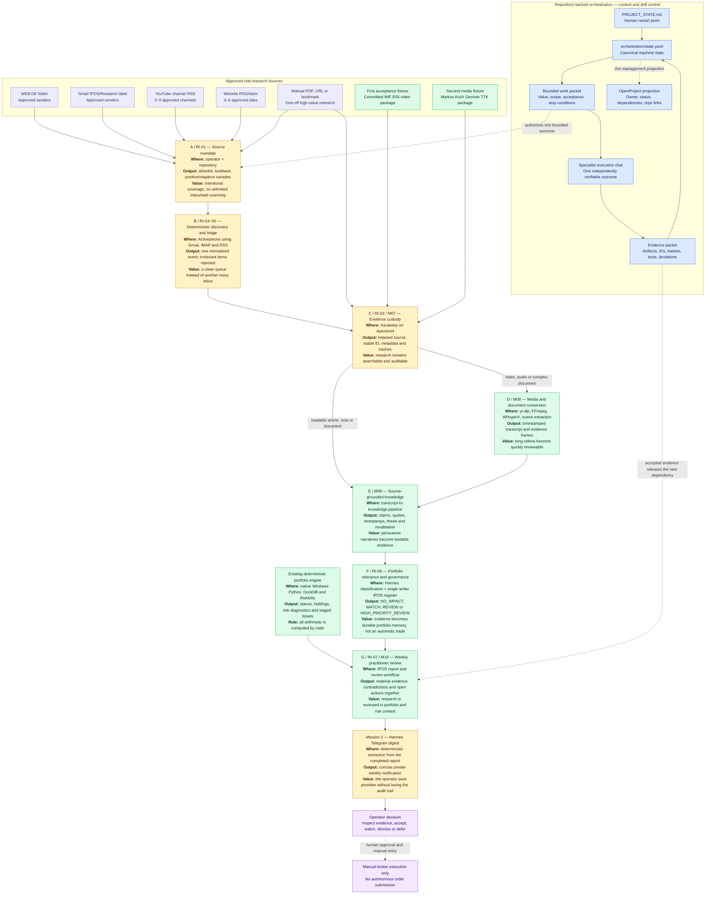

# Handover: Research Intake Bootstrap for IPOS

> **Operator purpose:** Turn a small, approved set of emails, YouTube channels,
> websites, PDFs, and manual bookmarks into durable, searchable, source-grounded
> investment evidence without creating a new investment engine.
>
> **Status:** Approved design; OpenProject placement verified and awaiting the operator's two-phase approval for project creation.
> **Date:** 2026-09-28.
> **Repository:** `C:\GitDev\Investment` on branch `main`.

## 1. Authority Router — Do Not Load Every Plan

This handover does not replace the existing plans. It converts them into one
operator-facing execution slice and resolves environment drift between the
August plans and the ratified September architecture.

An orchestrator starts with only:

1. `PROJECT_STATE.md`
2. this handover
3. `docs/superpowers/specs/2026-09-28-repository-backed-orchestration-design.md`
4. `orchestration/state.yaml`
5. the single active packet referenced by `orchestration/state.yaml`

An executor reads only its bounded packet and the exact authority sections cited there. The files
below are an authority catalog, not a mandatory bulk-reading list:

| Authority | Load only when resolving |
|---|---|
| `HANDOVER_STAGE_IMPLEMENTATION.md` | Operational stage contracts or the two original delivery missions |
| `06_modular_pipeline_alignment/00_INDEX.md` | Current Windows/WSL/Apex architecture, service boundaries, or compact US-01..US-12 mapping |
| `05_blueprint/research/2026-08-28-modular-rebuild/08_USER_STORIES_AND_INTEGRATION_WORKFLOWS.md` | Detailed email, video, evidence, impact, action, review, or health behavior |
| `05_blueprint/research/2026-08-28-modular-rebuild/implementation-plans/M04_ACTIVEPIECES_PLATFORM.yaml` | Activepieces deployment and platform proof |
| `05_blueprint/research/2026-08-28-modular-rebuild/implementation-plans/M05_ACTIVEPIECES_EMAIL_EVENT_FLOWS.yaml` | Web.de/Gmail event routing |
| `05_blueprint/research/2026-08-28-modular-rebuild/implementation-plans/M07_KARAKEEP.yaml` | Karakeep custody deployment and acceptance |
| `05_blueprint/research/2026-08-28-modular-rebuild/implementation-plans/M08_MEDIA_PIPELINE.yaml` | Media acquisition, transcription, and frame evidence |
| `05_blueprint/research/2026-08-28-modular-rebuild/implementation-plans/M09_TRANSCRIPT_TO_KNOWLEDGE.yaml` | Source-grounded knowledge transformation |
| `05_blueprint/research/2026-08-28-modular-rebuild/implementation-plans/M19_END_TO_END_ACCEPTANCE.yaml` | Cross-component practitioner acceptance |
| `00_runbook/WF07_RESEARCH_TO_PORTFOLIO_DECISION_FLOW.md` | Promotion from evidence to portfolio decision stages |

The existing user stories remain authoritative: `US-EMAIL-01..03`,
`US-VIDEO-01..02`, `US-KB-01`, `US-EVIDENCE-01`, `US-IMPACT-01`,
`US-ACTION-01`, `US-REVIEW-01`, and `US-HEALTH-01`.

## 2. Current Architecture: Do Not Reintroduce Old Settings

Use the ratified architecture below even when an older plan or handover says
otherwise.

| Concern | Current authority | Stale setting to reject |
|---|---|---|
| Git | `main`, direct commits; preserve unrelated dirty-worktree changes | `ipos-modular-rebuild-2026-08-28` as active branch |
| Quantitative IPOS | Native Windows Python on NTFS under `C:\GitDev\Investment\.venv`; DuckDB stays on NTFS | Running core Python/DuckDB inside WSL over `/mnt/c` |
| Container services | Single WSL2 Ubuntu **Apex** Docker engine with native ext4 storage | Docker Desktop, additional Docker engines, artificial duplicate stacks |
| PostgreSQL | Existing shared cluster with isolated `priv_*`/`comm_*` databases and `REVOKE CONNECT` | New standalone PostgreSQL containers or cross-tenant access |
| Private PM | OpenProject 17.8 at `http://127.0.0.1:8083`; private project space only | Community OpenProject at `:9082`, legacy v14, port `8010` |
| Hermes | `http://127.0.0.1:8642` API and `:9119` UI; health verified as Hermes 0.20.5 | Assuming an old profile or path proves current tool permissions |
| Karakeep | Supporting custody service on Apex/ext4; expected service port `3000` when deployed | Treating port 3000 as currently live, mounting internal DB/search volumes to Windows |
| Activepieces | Supporting event router on Apex/ext4; expected service port `8080` when deployed | Treating Activepieces as the investment engine or as already deployed |
| Wealthfolio | Windows desktop GUI; manual one-click CSV synchronization only | Invented REST API, CLI, container, or headless wrapper |
| Numerical authority | Python/DuckDB/Riskfolio calculate; LLM/Hermes narrates and classifies evidence | LLM calculation of weights, prices, quantities, thresholds, or order tickets |

Reality observation on 2026-09-28 from the Windows host:

- OpenProject `:8083`: API v3 verified as version 17.8.0; API-token identity is user 4 (`OpenProject Admin`).
- Hermes `:8642` and `:9119`: reachable; `/health` returned version 0.20.5.
- Karakeep `:3000`: not reachable.
- Activepieces `:8080`: not reachable.
- Repository reality battery: `5 PASSED, 0 FAILED`.
- Test baseline: `271 passed`.
- Repository QA: `ALL REQUIRED TESTS PASSED`.

Therefore M04, M05, and M07 are plans to execute, not deployed capabilities.

## 3. What the Operator Ultimately Receives

The product is not “a folder of transcripts.” It is a monitored research
process that answers four investment-practitioner questions:

1. **What new information arrived from sources I trust?**
2. **What exactly did the source say, and can I verify it?**
3. **Which thesis, risk factor, instrument, or holding could it affect?**
4. **Do I need to act now, watch a condition, or ignore it?**

The intended experience is:

```text
Approve a source once
        -> new item is detected exactly once
        -> original source is preserved and searchable
        -> long media becomes a reviewable transcript/evidence package
        -> claims retain exact quotes and timestamps
        -> portfolio relevance becomes NO_IMPACT / WATCH / REVIEW / HIGH_PRIORITY_REVIEW
        -> unresolved items appear in the weekly review
        -> all broker execution remains manual
```

### End-to-End Product and Orchestration Map

This map combines the existing user stories, M04/M05/M07/M08/M09/M19 plans, RI-01 through RI-07,
the proven media fixtures, the current operational IPOS capabilities, and the approved
repository-backed orchestration model. The orchestration lane controls scope and continuity; it does
not replace or perform the product flow.



Status interpretation:

- **Yellow:** planned operational capability; Activepieces and Karakeep were not reachable in the
  2026-09-28 reality check, and Telegram dispatch is not yet accepted as operational.
- **Green:** existing or fixture-proven capability; this does not imply every component is already a
  scheduled production service.
- **Blue:** orchestration/control information, not an investment-processing stage.
- **Purple:** actions that remain under direct operator control.

Authoritative detail remains in the existing
[`user stories`](05_blueprint/research/2026-08-28-modular-rebuild/08_USER_STORIES_AND_INTEGRATION_WORKFLOWS.md),
the stage descriptions below, and the cited M04–M19 plans. The
[`orchestration design`](docs/superpowers/specs/2026-09-28-repository-backed-orchestration-design.md)
defines how bounded chats execute this flow without losing context or inventing parallel plans.

## 4. The Process, Its Outputs, and Practitioner Value

### Stage A — Source Mandate

**Input**

- Approved Web.de senders or folder.
- Approved Gmail senders or `IPOS/Research` label.
- YouTube channel or playlist URLs.
- Website RSS/Atom feeds or public article-section URLs.
- Manually supplied PDFs and bookmarks.
- Topic, priority, and history/lookback rule for each source.

**Process**

Create one allowlisted source registry. Do not start with open-ended AI scanning
of whole mailboxes or the public web. Record what should be watched, why it is
trusted, which topics matter, and what content should be ignored.

**Output**

An approved source register plus representative positive and negative samples.

**Practitioner value**

This is the investment-research mandate. It makes coverage intentional, shows
which viewpoints are represented or missing, and prevents time being consumed
by newsletters and videos that were never considered decision-relevant.

### Stage B — Deterministic Discovery and Triage

**Input**

New mail in the approved Web.de folder or Gmail label; new YouTube/RSS entries;
manual PDF/URL submissions.

**Process**

Activepieces uses supported Gmail, IMAP, RSS, HTTP, and webhook capabilities.
It applies sender/label/feed filters, creates an idempotency key from the source
identity, and normalizes the event fields already defined by M05:

`event_id`, `source`, `source_message_id`, `sender`, `subject`, `received_at`,
`body_ref`, `attachment_refs`, `urls`, `classification_hint`, `ingested_at`.

**Output**

Exactly one normalized event classified as `EMAIL_RESEARCH`,
`EMAIL_ANALYST_SIGNAL`, `VIDEO_RESEARCH`, or `DOCUMENT_RESEARCH`; irrelevant
mail is ignored and failures become `SYSTEM` events.

**Practitioner value**

The operator gets a clean research queue rather than another inbox. Duplicate
newsletter delivery cannot create duplicate recommendations. An explicit
BUY/SELL/REDUCE/ADD/HOLD/WATCH statement is visible quickly, but remains a
source recommendation rather than a trade instruction.

### Stage C — Evidence Custody in Karakeep

**Input**

The normalized event and its URL, article, PDF, attachment, note, or video
reference.

**Process**

Karakeep stores/searches the original source, readable content, tags, notes, and
supported assets. IPOS exports through the product API; it never reads
Karakeep's PostgreSQL or Meilisearch volumes directly. Each exported item keeps
the foreign identity `karakeep:entries:<id>`, source timestamps, and SHA-256
receipts. Duplicate and pagination behavior must be tested.

**Output**

A durable, searchable evidence record that can be opened independently of the
email that announced it.

**Practitioner value**

Research stops disappearing into mail folders, browser tabs, and watch-later
lists. Weeks later, the operator can retrieve the exact source behind a thesis,
contradiction, or staged action and see whether it has changed.

### Stage D — Media and Document Conversion

**Input**

A selected video/audio item or document that passed source triage.

**Process**

Reuse the proven M08 toolchain: yt-dlp for acquisition, FFmpeg for media/audio,
WhisperX or the selected faster-whisper configuration for transcription, and
PySceneDetect for candidate frames when charts matter. Preserve raw outputs and
reviewed corrections separately. Do not transcribe every detected video by
default; acquisition cost must be justified by relevance.

**Output**

A hashed media package: original/reference, metadata, timestamped transcript,
word alignment where required, and timestamp-linked chart frames.

**Practitioner value**

A one-hour research video becomes searchable and reviewable in minutes. The
operator can jump to the exact quote or chart instead of trusting a free-form
summary, and can distinguish what the speaker said from what the system inferred.

### Stage E — Source-Grounded Knowledge

**Input**

Immutable transcript/document text plus source metadata.

**Process**

Reuse M09 and the validated TTK V2 pipeline. Produce macro synthesis, meso
modules, atomic claims, exact quote anchors, entity/concept pages, and a
verification queue. Every investment claim must retain source identity and
evidence location. Unsupported numerical claims remain unverified.

**Output**

A compact research card and structured knowledge packet containing:

- what changed;
- the source's thesis;
- affected themes/assets;
- exact supporting quotes/timestamps;
- falsification or invalidation condition;
- unresolved verification questions.

**Practitioner value**

The output separates a source's persuasive narrative from testable claims. It
lets the operator compare multiple analysts over time and revisit the condition
that would make an earlier thesis wrong.

### Stage F — Portfolio Relevance and Action/Watch Governance

**Input**

The knowledge packet, current holdings, existing theses, IPOS state, and open
register items.

**Process**

Hermes asks the questions already defined in `US-IMPACT-01`: which assets or
scenarios are affected, whether they are held, whether the evidence reinforces
or contradicts current state, and whether notification is justified. The
result is `NO_IMPACT`, `WATCH`, `REVIEW`, or `HIGH_PRIORITY_REVIEW`. Only the
single-writer IPOS register persists accepted items.

**Output**

An evidence-linked ACTION or WATCH item, or an explicit no-impact result.

**Practitioner value**

This is where research becomes usable portfolio memory. It prevents every
interesting article from becoming a trade while ensuring a real challenge to a
held position or macro thesis is not forgotten before the weekly review.

### Stage G — Weekly Decision Use

**Input**

Open evidence-linked items plus the pre-computed IPOS macro stance, holdings,
Riskfolio diagnostics, and order staging output.

**Process**

The deterministic Windows pipeline computes all numbers. Hermes may explain
connections and contradictions but cannot resize positions or alter prices.

**Output**

The weekly report and digest contain material new evidence, active
contradictions, unresolved WATCH/ACTION items, and pre-computed order tickets.

**Practitioner value**

The operator reviews research in the same context as exposures and portfolio
risk, instead of maintaining separate mental models across email, YouTube,
notes, charts, and broker statements.

## 5. Reuse the Existing Proven Sources as Acceptance Fixtures

Do not begin by requesting an entirely new video corpus. The machine already
contains committed proof artifacts suitable for the first end-to-end tests.

| Fixture | Existing proof | What it already proves | How to reuse it |
|---|---|---|---|
| IMF WEO July 2026 video (`vzZpKJlpqKo`) | `C:\GitDev\Investment\implementation-runs\E05\20260923-230911\` at commits `e5c073c` and `62eb233` | Real yt-dlp/FFmpeg/WhisperX/PySceneDetect execution; 128.948-second source, 11 segments, 234 aligned words, 19 scenes, four reviewed evidence frames, hashes and known ASR errors | Primary media-custody and timestamp-grounding fixture; ingest into Karakeep without silently correcting raw ASR |
| Markus Koch: “Tech unter Druck. Zinsen werden zum Risiko” (`vFTuLylvYnA`, German) | `C:\GitDev\apexai-os-meta\artifacts\transcript_pipeline_v2\corrective-run\raw\p20-four-source\vFTuLylvYnA\` at commit `167ab114` | German semantic coherence, numeric preservation, transcript-to-knowledge lifecycle, claims/modules/ledger | Primary German investment-research fixture for Web.de/Gmail/video routing and TTK reuse |
| Elliott Prechter: “Teaching a Machine to Count Elliott Waves” (`CygwqaNg2PY`) | sibling four-source directory, commits `167ab114` and `130a61b6` | English fresh ASR plus technical-market concept extraction and evidence closure | Technical-market research fixture and resume/idempotency test |
| Market Cycles Report, 2026-08-17 (`oZIsMX6WgFs`) | sibling four-source directory, commit `167ab114` | Procedural market-cycle recall and evidence-grounded structured output | Macro/cycle research fixture for WATCH-condition extraction |
| Ralph Adolphs emotions lecture (`P-h5WSQG1Sw`) | sibling four-source directory, commits `afd17609` and `167ab114` | Long-form transcript robustness with 92 micro claims and four meso modules | Non-investment/domain-control fixture; proves the intake can archive a source without forcing portfolio relevance |

The August 18 V2 report states that all four sources passed provenance,
spot-check, macro/meso/micro, and complete validation gates; the fresh bilingual
run passed English and German with no measured knowledge degradation. These
artifacts remain read-only test inputs. Do not move, rewrite, or duplicate the
source-of-record directories.

Known limitations must remain visible:

- The IMF run is `PASS_WITH_AUDIT_GAPS`, not a scheduled batch service.
- Same-source canonical deduplication and unsupported/private-source routing
  were not proven in E05.
- Raw ASR is evidence, not automatically verified fact.
- The TTK four-source success does not prove Gmail, Web.de, Activepieces, or
  Karakeep deployment.

## 6. Minimal Initial Source Mandate for the Operator

The operator should provide identifiers and examples, not passwords in chat.

```text
WEB.DE
- approved senders/domains
- target folder name (recommended: IPOS Research)
- one relevant .eml example
- one irrelevant .eml example

GMAIL
- approved senders/domains
- target label (recommended: IPOS/Research)
- one relevant message example
- one duplicate/forwarded-message example

YOUTUBE
- 3-5 channel URLs
- optional playlists
- topic/keyword filters, if any
- default history: last 30 days plus new items

WEBSITES
- 3-5 public sites or section URLs
- RSS/Atom feeds where known
- login/paywall status

PDF/MANUAL
- 1-2 representative PDFs with publisher/source URL
- 1-2 one-off article bookmarks
```

Credentials stay in Gmail OAuth, Activepieces' connection store, Web.de's
IMAP connection, or Karakeep configuration. They never enter Git, OpenProject
descriptions, evidence files, or this handover.

## 7. Execution Order and Acceptance Value

### RI-01 — Confirm Source Mandate and Fixture Pack

- Reuse the five fixtures in Section 5.
- Add the operator's approved email/channel/site list and only the minimum new
  samples needed to exercise missing source classes.
- **Done when:** each source has an owner, reason for inclusion, detection
  method, priority, lookback, and positive/negative example.
- **Investment value unlocked:** the operator knows what the system watches and
  why; no hidden or unlimited surveillance scope.

### RI-02 — Deploy and Prove Karakeep Custody (existing M07)

- Deploy inside the existing Apex Docker environment on ext4; do not create a
  second engine or attach storage through `/mnt/c`.
- Prove URL, PDF, RSS, tag/search, duplicate, API pagination, neutral export,
  and one restore sample.
- Import the IMF and one TTK fixture as test evidence.
- **Done when:** retained bytes and metadata can be retrieved and verified by
  hash, and Hermes initially has bounded read-only access.
- **Investment value unlocked:** durable research memory independent of inboxes
  and browser tabs.

### RI-03 — Deploy and Prove Activepieces Routing (existing M04)

- Deploy in the same Apex environment.
- Prove restart, backup/export, private ports, and one normalized webhook event.
- Keep all investment calculations outside Activepieces.
- **Done when:** a fixture event survives restart and routes once without
  exposing connection secrets.
- **Investment value unlocked:** reliable source monitoring without a custom
  mail/RSS platform.

### RI-04 — Configure Web.de and Gmail (existing M05)

- Use Web.de IMAP SSL/993 and the supported Gmail connector.
- Restrict intake to approved folders/labels/senders.
- Run M05's research, action-signal, video-link, attachment, duplicate,
  irrelevant-message, and authentication-failure cases.
- **Done when:** both providers produce the same normalized event contract and
  duplicates create no second downstream item.
- **Investment value unlocked:** important analyst material reaches the
  research queue without manually forwarding or searching mail.

### RI-05 — Configure YouTube and Website Discovery

- Prefer YouTube channel RSS and website RSS/Atom.
- Add custom scraping only for a specific high-value source with no supported
  feed, after documenting terms, authentication, and failure behavior.
- Route selected videos through M08 and M09 using the existing fixtures first.
- **Done when:** one new video and one new article are detected, retained, and
  made reviewable exactly once.
- **Investment value unlocked:** the operator no longer needs to remember which
  channels and sites to check each week.

### RI-06 — Wire Karakeep Export to IPOS Evidence Intake

- Finish the live REST connector only after RI-02 establishes the observed API
  version and response schema.
- Preserve `karakeep:entries:<id>`, hashes, pagination, and idempotency.
- Raw custody items may exist without claims; only grounded claims can enter
  the register.
- **Done when:** malformed schemas fail closed, repeated sync is idempotent,
  and the IMF/Koch fixtures retain source-to-claim lineage.
- **Investment value unlocked:** new evidence can challenge or reinforce a
  thesis without contaminating deterministic portfolio calculations.

### RI-07 — End-to-End Practitioner Acceptance (existing M19)

Run at minimum:

1. Web.de/Gmail research email -> Karakeep -> Hermes research result.
2. Explicit analyst action signal -> exactly one open ACTION; zero trade.
3. IMF or Koch video -> transcript -> evidence-grounded knowledge -> impact.
4. RSS article -> custody -> WATCH/NO_IMPACT decision.
5. Duplicate replay -> no second notification or register item.
6. Mail auth failure and Karakeep outage -> visible SYSTEM behavior.

- **Done when:** the operator can answer the four questions in Section 3 from
  the produced artifacts, all figures remain source- or code-grounded, and no
  automatic trading interface exists.
- **Investment value unlocked:** a realistic, auditable research-to-portfolio
  loop rather than a collection of disconnected automation demos.

## 8. OpenProject Placement and Work-Package Shape

The authoritative destination is **private OpenProject 17.8 at port 8083**.
Never create these tasks in the community OpenProject instance.

Do not create a new OpenProject project or subproject merely for this slice.
First locate the existing private project that owns the committed IPOS modular
rebuild work packages. Create one parent work package there:

**`IPOS — Research Intake & Evidence Operations`**

Create RI-01 through RI-07 as children. Link them to existing M04, M05, M07,
M08, M09, and M19 work packages when those exist; do not duplicate them. If an
existing work package already represents the same deliverable, update its
description/acceptance criteria and attach this handover instead of creating a
new child.

Fail closed if the owning project cannot be established. Candidate project
names visible in audit evidence are not sufficient proof of ownership. The
agent must inspect the signed-in private instance and identify the project
containing the IPOS/M01-M19 work packages. If none exists, ask the operator
whether to create an `Investment / IPOS` subproject; do not silently place the
work under infrastructure, demo, Scrum, or community projects.

Suggested hierarchy:

```text
IPOS — Research Intake & Evidence Operations
├─ RI-01 Confirm source mandate and fixture pack          [operator input]
├─ RI-02 Deploy and prove Karakeep custody                [M07]
├─ RI-03 Deploy and prove Activepieces routing            [M04]
├─ RI-04 Configure Web.de and Gmail                       [M05]
├─ RI-05 Configure YouTube and website discovery          [M08/M09]
├─ RI-06 Wire Karakeep export to IPOS evidence intake     [WF-07 Stages 1-3]
└─ RI-07 End-to-end practitioner acceptance               [M19]
```

Dependencies:

- RI-01 can start immediately.
- RI-02 and RI-03 may execute after the current Apex topology is confirmed.
- RI-04 depends on RI-01, RI-02, and RI-03.
- RI-05 depends on RI-01 and RI-02; media conversion reuses M08/M09.
- RI-06 depends on RI-02 and observed live API schemas.
- RI-07 depends on RI-04, RI-05, and RI-06.

OpenProject placement verification on 2026-09-28 found five accessible projects
(`PM Infrastructure`, `Leela & Mastery`, `Leela`, `Scrum project`, and `Demo project`) and no
work package matching IPOS, M01-M19, Karakeep, Activepieces, Hermes, Research Intake, or Evidence
Operations. Therefore none is an evidenced owner for this work. The safe proposed destination is a
new private top-level project named **`Investment / IPOS`**, not a child of an unrelated Leela or
infrastructure project. Project creation and subsequent work-package creation remain separate,
two-phase OpenProject API writes. No OpenProject object has yet been created or changed.

## 9. What `PROJECT_STATE.md` Is

`PROJECT_STATE.md` is the repository's compact living index for a new human or
agent session. It records the current execution frontier, completed
capabilities, next steps, and authoritative file map. It is not:

- a replacement for OpenProject;
- a detailed implementation plan;
- a runtime database;
- a place for credentials or operational evidence.

OpenProject answers “who owns which work and what is its delivery state?”
`PROJECT_STATE.md` answers “where should a new repository session start, and
which contracts describe reality?” Both must point to the same frontier.

## 10. Next-Agent Kickoff Prompt

```text
Work in C:\GitDev\Investment on main. Read PROJECT_STATE.md,
HANDOVER_RESEARCH_INTAKE_BOOTSTRAP.md, the approved repository-backed orchestration design,
orchestration/state.yaml, and only the active packet named there. Load larger authority files only
when the packet cites them. Do not reuse stale branch, runtime, port, database, or Docker assumptions
from older handovers. Verify the reality battery before changes.

Start with RI-01 only. Do not create or dispatch an RI-02 packet until RI-01 is accepted and
`orchestration/state.yaml` releases that dependency. Reuse the committed IMF E05 fixture and the
four TTK V2 fixtures in C:\GitDev\apexai-os-meta; do not request a new video corpus until those
acceptance fixtures have exercised custody, deduplication, provenance, and source-to-claim lineage.
Use the authenticated private OpenProject 17.8 API. The
2026-09-28 ownership scan found no project containing IPOS or M01-M19 work packages, so request
operator approval for the previewed `Investment / IPOS` project creation before adding the RI
hierarchy. Never place IPOS work in the community instance or an unrelated private project.

The useful result is an operator-facing research queue and evidence trail that
answers: what arrived, what was said, what it affects, and whether it is
NO_IMPACT/WATCH/REVIEW/HIGH_PRIORITY_REVIEW. Preserve zero LLM arithmetic,
Windows-native quantitative execution, ext4 container storage, and manual-only
broker execution.
```
